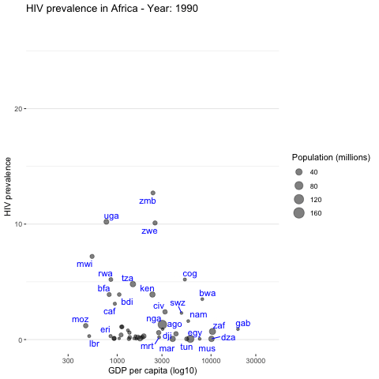

```{r setup, include=FALSE}
knitr::opts_chunk$set(echo = FALSE, message=FALSE, warning=FALSE)
library(knitr)
library(kableExtra)
library(dplyr)
library(tidyr)
library(readr)
library(stringr)
library(readxl)
library(ggplot2)
#library(haven)
#library(lubridate)
#library(haven)
library(vcd)
library(gganimate)
#library(purrr)
```

# Introduction

We are constantly surrounded by information in today's digital world. But not all of it is accurate. 
We rely on data to gauge whether something is true or false.
Also, more and more data is being collected and stored and the information contained in these data needs to be unlocked.

We rarely see this data in its raw form. You can imagine how rows and rows of numbers could be very confusing to interpret.
Because of this we usually use a method called data visualisation to present patterns and trends in data more easily.

**Data visualisation is the translation of data into visual representations, like charts and graphs, to communicate the information contained in the data.**

Whilst this method simplifies the process of understanding data it can also bend the truth and misrepresent information if care is not exercised.

<br>

An effective graph is a visualisation of data that unlocks and conveys information or a story from data. This may help verify or debunk beliefs or assumptions, answer questions about a topic/issue or guide further research.

The first element needed in data visualisation is ... data!

* Make sure that you understand its structure and that the data is "wrangled and clean". In most situations, the data will come in inadequate formats and/or contain other anomalies such as missing values, outliers, etc. Quite likely this will arise whilst visualising the data. Organise the data in a form suitable for the display you want to create. 
* Do not "cherry pick" your data to suit some belief. 
* Be honest and make sure that you understand how representative the data is.

When you start plotting the data, don't expect your first or even third attempt to produce the final display. You will arrive at your preferred display after a few iterations.

What elements should a good plot contain?

1. **Content**: The plot tells a story easily. Given that you can plot the same data in many different ways, chosse the display that is most informative to answer the question at hand. Avoid displays that are overly complicated, even though ingenious. Is the plot conveying the information you want? Have you given enough context for others to be able to interpret the charts?
2. **Minimalism**: Does the type of plot you chose contain superfluous elements? If so, remove them so that the story is enhanced.


I will illustrate these points in what follows.

# Case Study: Multiple graphs in one plot. Massachusetts Bay Transport Authority (MBTA) data

Let us consider monthly transportation data in Boston, USA, consisting of monthly averages of weekday number of passengers (in thousands) by mode of transportation from 2007 until 2011.

The data is already in tidy format.

Let us visualise the data.

```{r}
mbta_tidy <- read_csv("Data/mbta_clean.csv")
mbta_tidy <- mbta_tidy %>% 
  mutate(Month = month.abb[month]) %>% # create a vector with the month abbreviations from month number
  mutate(Month = factor(Month, ordered = TRUE, levels = rev(c("Jan", "Feb", "Mar", "Apr", "May", "Jun", "Jul", "Aug", "Sep", "Oct", "Nov", "Dec"))))
```

## **Box plots**

Box plots are useful to have a quick (and resistant to outliers) view of the distribution of data. Note that box plots should only be used if the distribution is unimodal.

Boxplots show the median and first and third quartile of a data set, as well as whiskers which extend 1.5 times the interquartile range beyond the first and third quartile. Data beyond the whiskers are considered to be outliers and deserve some special consideration.


<br>

Box plots by mode of transportation show the distribution of average weekday number of passengers by mode of transportation. This visualisation helps us to understand the use of the different modes of transportation.


<br>

```{r warning = FALSE} 
my_labels <- c("Boat", "Bus", "Commuter \nRail", "Heavy \nRail", "Light \nRail", "Private \nBus", "RIDE", "Trackless \nTrolley")

ggplot(mbta_tidy, aes(x = mode , y = NrPassengers, color = mode)) +
  geom_boxplot() +
  labs(y = "Average weekday number of passengers (1000s)") +
  ggtitle("Boxplots of average number of passengers by travel mode") +
  theme(plot.title = element_text(hjust = 0.5)) +
  scale_x_discrete(labels= my_labels)

# ggsave("Plots/mbta_boxplot_1.jpg")
```
<br>

The plot is useful because it immediately conveys the message that Heavy Rail is the mode of transportation mostly used followed by Bus, Light Rail and Commuter Rail. Boat, Private Bus, Trackless Trolley and RIDE (shared transportation for passengers who cannot use the other modes of transportation) are the least used modes of transportation.

> **_For discussion:_**  What is not just quite right with this plot?


The scale of the number of passengers for the most and least used modes of transportation is too different and so it is not possible to make any inferences about the distribution of the number of passengers for the 4 least used modes of transportation.

<br>

Therefore, if the visualisation above is used, a separate visualisation of the least used modes of transportation is needed.

<br>

```{r warning = FALSE}
#mbta5 contains the data only for boat, private bus, RIDE and trackless trolley.
mbta5 <- filter(mbta_tidy, mode %in% c("Boat", "Private Bus", "RIDE", "Trackless Trolley"))
ggplot(mbta5, aes(x = mode , y = NrPassengers, color = mode)) +
  geom_boxplot() +
  labs(y = "Average weekday number of passengers (1000s)") +
  ggtitle("Boxplots of average number of passengers by \nboat, private bus, RIDE and trackless trolley") +
  theme(plot.title = element_text(hjust = 0.5))
```

It wasn't possible to view the features of the distributions of the number of passengers for the 4 least used modes of transportation in the first plot. 

There are some unusually low observations for Trackless Trolley. Private Bus has a very skewed distribution.

> **_For discussion:_**  What would you change in these plots?

I propose now to apply the principle of minimalism to this plot.

<br>

```{r warning = FALSE}
#mbta5 contains the data only for boat, private bus, RIDE and trackless trolley.
mbta5 <- filter(mbta_tidy, mode %in% c("Boat", "Private Bus", "RIDE", "Trackless Trolley"))
ggplot(mbta5, aes(x = mode , y = NrPassengers, fill = mode)) +
  geom_boxplot() +
  labs(y = "Weekday average number of passengers (1000s)", x = "") +
  # ggtitle("Box plots of average number of passengers by \nboat, private bus, RIDE and trackless trolley") +
  theme(plot.title = element_text(hjust = 0.5)) +
  theme_bw() +
  theme(
        panel.grid.major.x = element_blank(), # remove the vertical grid lines
        panel.grid.minor.x = element_blank(), # remove the vertical grid lines
        panel.border = element_blank(), # remove the frame around the graph
        #panel.grid.major.y = element_blank(),
        #panel.grid.minor.y = element_blank(),
        legend.position = "none" # remove the legend 
      ) +
  ggtitle("Distribution of weekday average number of passengers")
```

<br>

I have removed the background colour, the vertical grid, the legend, the x-axis label, and added a more succinct title. As the background is white, I have also filled the boxes with colour rather than colour just the border of the box.

## **Time plots**

Now let us visualise how the the number of passengers has evolved in time for the different modes of transportation in order to add more insight.

<br>

```{r}
 ggplot(mbta_tidy, aes(x = date, y = NrPassengers, col = mode)) +
  geom_line() +
  geom_point()+
  labs(y = "Average Weekday Number of Passengers (thousands)")
```

<br>

As before, it is impossible to observe any trends for the 4 least used modes of transportation.
Also, the trend for the 4 most used forms of transportation are flattened as the y-axis starts at zero.

We view them separately, 

<br>

```{r}
mbta5 <- filter(mbta_tidy, mode %in% c("Boat", "RIDE", "Trackless Trolley", "Private Bus"))#this selects the rows corresponding to passengers who traveled by boat, car, trackless trolley and private bus
ggplot(mbta5, aes(x = date, y = NrPassengers, col = mode)) +
  geom_line() +
  geom_point() +
  labs(y = "Average Weekday Number of Passengers (thousands)")
```

<br>

We see that there are distinctive features for these modes of transportation:

* Trackless trolley has some unusually low observations during 6 consecutive months in 2010. This is possibly due to the service not being fully available due to construction, etc.
* Boat is seasonal, with highest numbers travelling by boat in the summer.
* Private Bus has seen a decline in 2009, possibly due to lack of funding. Trackless Trolley also has a decline since 2009.
* The trend for RIDE is upwards, possibly more funding available.

> **_For discussion:_**  How would you improve the plots above?

For example, remove the x-axis name "date" and the legend name "mode" as these are obvious.

I personally like the background grid because it makes it easier to detect changes in trends and when they happened.
Given the option of a hover tool which displays information of the data, perhaps the vertical grid can be erased.

Let's try with a white background with only a horizontal grid. Remove the legend title (as it's obvious in this case)

<br>

```{r}
mbta5 <- filter(mbta_tidy, mode %in% c("Boat", "RIDE", "Trackless Trolley", "Private Bus"))#this selects the rows corresponding to passengers who traveled by boat, car, trackless trolley and private bus
ggplot(mbta5, aes(x = date, y = NrPassengers, col = mode)) +
  geom_line() +
  geom_point() +
  labs(y = "Weekday Average Number of Passengers (thousands)", x = "") +
  theme_bw() +
  theme(
        panel.grid.major.x = element_blank(), # remove the vertical grid lines
        panel.grid.minor.x = element_blank(), # remove the vertical grid lines
        panel.border = element_blank() # remove the frame around the graph
        #panel.grid.major.y = element_blank(),
        #panel.grid.minor.y = element_blank()
      ) +
  theme(legend.title=element_blank()) # remove the legend title
  

```

<br>

This plot is less busy therefore more satisfactory. Once you arrive to a display that conveys the information you want, ask yourself, are there any elements superfluous? If I remove an element, such a grid line or a background colour, is it still easy to convey the story about the data?


The time plots for the 4 most used modes of transportation is below. Note how much better the trends can be viewed compared to the previous plot where the y-axis had a zero origin.

```{r}
mbta5 <- filter(mbta_tidy, !mode %in% c("Boat", "RIDE", "Trackless Trolley", "Private Bus"))#this selects the rows corresponding to passengers who traveled by boat, car, trackless trolley and private bus
ggplot(mbta5, aes(x = date, y = NrPassengers, col = mode)) +
  geom_line() +
  geom_point() +
  labs(y = "Weekday Average Number of Passengers (thousands)") +
  theme_bw() +
  theme(
        panel.grid.major.x = element_blank(), # remove the vertical grid lines
        panel.grid.minor.x = element_blank(), # remove the vertical grid lines
        panel.border = element_blank() # remove the frame around the graph
        #panel.grid.major.y = element_blank(),
        #panel.grid.minor.y = element_blank()
      ) +
  theme(legend.title=element_blank()) # remove the legend title
  

```

## **Bar plots**

We can use bar plots to display the data.

Let us consider just the data for Boat and Trackless Trolley.


```{r}
data_boat_trlessTroll <- mbta_tidy %>% 
  group_by(mode, Month) %>% 
  summarize(average_nr_passengers = mean(NrPassengers)) %>%
  filter(mode %in% c("Boat", "Trackless Trolley")) 
```


Now we will produce a stacked bar plot. Note that the coordinates are flipped as I think that in this case it is easier to see the data like this.

<br>

```{r}
data_boat_trlessTroll%>%
  ggplot(aes(x = Month, y = average_nr_passengers, fill = mode)) +
  geom_bar(stat = "identity") + 
  coord_flip() +
  geom_text(aes(label=round(average_nr_passengers, 2)), position = position_stack(0.5)) +
  labs(y = " ", x= "") +
  theme_bw() +
  theme(
        panel.grid.major.x = element_blank(), # remove the vertical grid lines
        panel.grid.minor.x = element_blank(), # remove the vertical grid lines
        panel.border = element_blank(), # remove the frame around the graph
        #panel.grid.major.y = element_blank(),
        #panel.grid.minor.y = element_blank(),
        axis.text.x=element_blank(),
        axis.ticks.x=element_blank()
      ) +
  theme(legend.title=element_blank()) +  # remove the legend title
  ggtitle("Weekday Average Number of passengers (thousands)")
```
<br>

* It's obvious that the columns correspond to months so I don't label the y-axis.
* Note that I have ordered months from January in the top to December in the bottom. This is because, at least in this part of the world, we tend to read and order from top to bottom.
* Note that we can get rid of all the tick marks of the x-axis since the bars are annotated with the numbers. I prefer annotations to axis tick marks and labels.
* Instead of an x-axis label I put a title to the plot.

<br>

<br>

Perhaps in this situation it is best to display the data as a grouped bar chart rather than a stacked bar chart because the grouped bar chart allows at a glance to see that there are more passengers travelling by trackless trolley than boat and that boat is seasonal.

<br>

```{r}
data_boat_trlessTroll %>%
  mutate(Month = factor(Month, ordered = TRUE, levels = month.abb)) %>%
  ggplot(aes(x = Month, y = average_nr_passengers, fill = mode)) +
  geom_bar(stat = "identity", position = position_dodge()) +
  geom_text(aes(label=round(average_nr_passengers, 1)), position = position_dodge(0.8), vjust = 1.5, 
            hjust = .5, size=3) +
  theme_bw() +
  labs(y = " ", x = " ") +
  theme(
        panel.grid.major.x = element_blank(), # remove the vertical grid lines
        panel.grid.minor.x = element_blank(), # remove the vertical grid lines
        panel.border = element_blank(), # remove the frame around the graph
        panel.grid.major.y = element_blank(),
        panel.grid.minor.y = element_blank(),
        axis.text.y=element_blank(),
        axis.ticks.y=element_blank()
          ) +
  theme(legend.title=element_blank()) +  # remove the legend title
  ggtitle("Weekday Average Number of passengers (thousands)")
```

<br>

* I think it's best NOT to flip this bar chart.

* Note that I got rid of the grid entirely. This is because the bars are annotated.

* Now months should be ordered from left to right.

<br>
<br>

* Make sure plots convey a message and you can tell a story by allowing data to display fully. If needed, produce more than one plot.
* The y-axis doesn't necessarily have to include 0. Whether it does or not depends on the scale of the displayed data. 
* If the range of the y-axis is not in line with the range of the data the plot will convey distortions, hide, possibly key features of the data. 
* Less is more: remove unnecessary elements from a graph without compromising the clarity of the information displayed.

# Case study: Association of qualitative variables. Berkeley admissions.

We consider graduate admission figures for the autumn of 1973 at the University of California, Berkeley. The numbers, shown below, seem to imply that men applying for post-graduate studies were more likely than women to be admitted. It was argued that the difference was so large that it was unlikely to be due to chance. The data set is usually presented as follows:

```{r echo = F}
Applicants <- c(8442, 4321)
Admitted <- c("44%", "35%")
Berk_messy1 <- cbind(Applicants, Admitted)
row.names(Berk_messy1) <- c("Men", "Women")

kable(Berk_messy1,align='ccc', caption = "Berkeley admissions data by gender and admission status") %>%
  kable_styling(bootstrap_options = c("striped", "condensed"), full_width = F)
```

The data above has been aggregated through departments. However, it is known that different genders have different preferences of departments they apply to (women have a preference for e.g. psychology or English studies, men have a preference for e.g. engineering studies).

When examining the individual departments, it appeared that six out of 85 departments were significantly biased against men, whereas only four were significantly biased against women. The data from the six largest departments are listed below.

```{r echo = F}
Applied_men <- c(825, 560, 325, 417, 191, 373)
Admitted_men <- c("62%", "63%", "37%", "33%", "28%", "6%")
Applied_women <- c(108, 25, 593, 375, 393, 341)
Admitted_women <- c("82%", "68%", "34%", "35%", "24%", "7%")
Department <- c("A", "B", "C", "D", "E", "F")
Berk_messy2 <- data.frame(Department, Applied_men, Admitted_men, Applied_women, Admitted_women)
#Berk_messy2 <- as.data.frame(Berk_messy2, stringsAsFactors = F)
kable(Berk_messy2, align = 'ccccc', caption = "Berkeley admissions data with admissions status by department") %>%
  kable_styling(bootstrap_options = c("striped", "condensed"), full_width = F)
```

## **Mosaic plots**

We visualise this data set of categorical, non-ordinal data using a mosaic plot.
Mosaic plots are useful for visualizing proportions in more than 2 dimensions.

<br>

```{r}
Berk_tidy2 <- read_csv("Data/BerkeleyDataTidy.csv")
Berk_tidy2 <- Berk_tidy2 %>%
  rename(`Admission Status` = AdmissionStatus)
```

```{r}
# create a contingency table
aux2 <- xtabs(number ~ Department + `Admission Status` + Gender, data = Berk_tidy2) 
 mosaic(aux2, highlighting = "Gender", highlighting_fill = c("pink", "lightblue"))
```

<br>

The heights and lengths of each mosaic are proportional to the proportions in the margins. So, a very flat rectangle indicates, proportionally, very few applicants of the corresponding gender in a given department. A long rectangle in the admitted status indicates that, proportionally, it's not so difficult to be accepted in the corresponding department.  As we can see there is no evidence for a discrimination case. In Departments A and B applicants are mainly male but in Department A, proportionally, more female than male applicants were admitted. Department F is very competitive and has a high rejection rate, which applies nearly equally to both female and male applicants.

This mosaic also shows the explanation: Selective departments have more female applicants. It’s easy to see since the departments are ordered by selectiveness. Departments A and B let in many applicants, but they’re mostly male. The reverse is true for the rest. This means that the overall female population takes big admittance hits in departments C through F, while lots of males get in via departments A and B.

One of the perils when studying associations between a variable of interest and a set of explanatory variables is overfitting. If we use too many explanatory variables we may explain very well the observed values of the variable of interest but nothing else and so our study will have little predictive value.

Problems also occur when relevant explanatory variables are ignored.
It is possible that when one ignores a relevant variable one observes an effect and when the variable is considered the opposite effect is observed. This is called Simpson's paradox.
What we have explored with the Berkeley graduate admissions data is one of the best-known examples of Simpson's paradox.

## **Treemap**

Let us visualise the Berkeley admissions data using a treemap.

<br>

```{r}
Berk <- Berk_tidy2 %>% 
  mutate(Department = paste("Dep", Department))
```

```{r}
library(treemap)
treemap(Berk, #Your data frame object
        index=c("Department", "Admission Status", "Gender"),  #A list of your categorical variables
        vSize = "number",  #This is your quantitative variable
        type="index", #Type sets the organization and color scheme of your treemap
        #palette = "Reds",  #Select your color palette from the RColorBrewer presets or make your own.
        
        title="Admission status by department and gender at UC Berkeley", #Customize your title
        #fontsize.title = 14 #Change the font size of the title
        )
```
<br>

Like mosaic plots, a treemap visually displays proportions by varying the area of a rectangular shape. 
In a treemap, you can display hundreds, or thousands, of pieces of information.
In a treemap you must arrange your data elements hierarchically using categorical variables, in a meaningful way for the information you want to display. 
The data you need is:

- A  quantitative variable that has positive values. This will be used to calculate the area of the rectangles in the treemap.
- One or more categorical variables associated with that quantitative variable allowing to group the data.

In the Berkeley admission data, the quantitative variable is "Number admitted". The categorical variables are "Department", "Admission Status", and "Gender", with that order of nesting (i.e. Gender within Admission Status within Department).

Note that the nesting or hierarchy is not always unique (you could nest admission status within department, for example). Therefore, you must think about what information you want to display and which nesting is most adequate.

For example, you could have procurement in government departments and each department has individual projects with a cost. There is only one natural hierarchy here, namely project within department.

<br>

> **_For discussion:_**  
 Would you change anything in the treemap?
 Which plot do you think conveys better the information about admissions and gender association?

<br>

# Case study: other ways of showing time variation - HIV prevalence

We will use data about Adults with HIV in Africa (estimated prevalence of HIV in percentage, ages 15-49) from Gapminder, 1990-2011.

The data consists of yearly HIV prevalence by country as well as income (GDP per capita, PPP$ inflation-adjusted) and population size. 

## **Scatter plots**

<br>

```{r}
HIV_Inc_Cont <- read_csv("Data/HIV_clean.csv")
```


```{r warning = FALSE}
aux <- filter(HIV_Inc_Cont, Year %in% c("1990", "1995", "2000", "2005", "2011"))
```


```{r}
aux %>% 
  ggplot(aes(x = Income, y = PrevalenceHIV, col = four_regions) ) + 
  geom_point(alpha = 0.8) + 
  #scale_x_log10() +
  labs(x = "GDP per capita (US$) - inflation adjusted" ) +
  labs(y = "Estimated HIV prevalence (%)" ) +
  theme(legend.title=element_blank()) +
  ggtitle("Plot of HIV prevalence vs income - all nations") +
  facet_grid(.~Year) + # one plot for each of the desired years
  theme(legend.position = "bottom")
```

<br>

> **_For discussion:_**  What would you change in this plot?

<br>

Income is a highly skewed variable as many countries have low to medium incomes and very few have very high incomes. Therefore, it is  difficult to see the information contained in the scatter plots as the points are cluttered towards low income values.

We will apply a logarithmic (base 10) transformation to income. The logarithm is an increasing function and so the order in the x-axis will be preserved.

<br>

```{r}
aux %>% 
  ggplot(aes(x = Income, y = PrevalenceHIV, col = four_regions) ) + 
  geom_point(alpha = 0.8) + 
  scale_x_log10() +
  labs(x = "GDP per capita (log10 $) - inflation adjusted" ) +
  labs(y = "Estimated HIV prevalence (%)" ) +
  theme(legend.title=element_blank()) +
  #ggtitle("Plot of HIV prevalence vs income - all nations") +
  facet_grid(.~Year) + # one plot for each of the desired years
  theme(legend.position = "bottom")
```

<br>

Most African countries have prevalence values in a scale which is about ten times than that of the rest of the world. This makes the visualisation difficult. It's best to visualise the data for African countries separately.

<br>

> **_For discussion:_** 
Can you think of any other ways of dealing with highly skewed variables?
What would you change in the above plot?

<br>

* Another way to deal with a highly skewed continuous variable is to convert it into discrete by defining suitable intervals  within its range. This is not straight forward and certainly the length of the intervals will be varying. Something to take into account is to choose interval lengths so that the number of observations in not excessively high in just a few of them.
* The scientific notation for income values (x-axis) is not very friendly. 

<br>

```{r}
aux %>% 
  ggplot(aes(x = Income, y = PrevalenceHIV, col = four_regions) ) + 
  geom_point(alpha = 0.8) + 
  scale_x_log10() +
  labs(x = "GDP per capita (log10 - $thousands) - inflation adjusted" ) +
  labs(y = "Estimated HIV prevalence (%)" ) +
  theme(legend.title=element_blank()) +
  #ggtitle("Plot of HIV prevalence vs income - all nations") +
  facet_grid(.~Year) + # one plot for each of the desired years
  theme(legend.position = "bottom") +
  scale_x_log10(breaks=c(1000,10000,100000),labels=c("1,000", "10,000", "100,000"))
```
<br>

Let us view the plot for Africa only.


```{r warning = FALSE}
#Only Africa
aux2 <- filter(aux, four_regions == "africa")# we further filter the data to select only countries in Africa
p_africa <- ggplot(aux2, aes(x = Income, y = PrevalenceHIV) ) + 
          geom_point(alpha = 0.8, show.legend = FALSE) +
          scale_x_log10() +
          labs(x = "GDP per capita (log10 $) - inflation adjusted" ) +
          labs(y = "Estimated HIV prevalence (%)" ) +
         #ggtitle("Plot of HIV prevalence vs income - Africa") +
          facet_grid(.~Year) +
  scale_x_log10(breaks=c(300,1000,3000, 10000, 30000),labels=c("300", "1000", "3000", "10000", "30000"))
    
p_africa
```
<br>

To gain more insight, let us identify the African countries with HIV prevalence greater than or equal to 10%. We add labels that do not overlap.

<br>

```{r}
#for year 1990
x_90 <- filter(aux2, PrevalenceHIV >= 10 & Year == "1990") #further filter the data selecting prevalence>=10 and year 1990
#select(x_90, 1:5)

#for year 1995
x_95 <- filter(aux2, PrevalenceHIV >= 10 & Year == "1995")
#select(x_95, 1:5)

#for year 2000
x_00 <- filter(aux2, PrevalenceHIV >= 10 & Year == "2000")
#select(x_00, 1:5)

#for year 2005
x_05 <- filter(aux2, PrevalenceHIV >= 10 & Year == "2005")
#select(x_05, 1:5) 

#for year 2011
x_11 <- filter(aux2, PrevalenceHIV >= 10 & Year == "2011")
#select(x_11, 1:5)
```

```{r}
library(ggrepel)
```

```{r warning = FALSE}
#Let us add the names of the countries with high HIV prevalence to the plots.

p_africa1 <- p_africa + 
             geom_text_repel(data = x_90, aes(label = geo) , col = "blue", size = 3) +
             geom_text_repel(data = x_95, aes(label = geo) , col = "blue", size = 3) +
             geom_text_repel(data = x_00, aes(label = geo) , col = "blue", size = 3) +
             geom_text_repel(data = x_05, aes(label = geo) , col = "blue", size = 3) +
             geom_text_repel(data = x_11, aes(label = geo) , col = "blue", size = 3) 
             
p_africa1
```


> **_For discussion:_**  What would you change in this plot?

I will make the background color white and remove vertical grid lines. I will leave the frame around each plot because in faceted plots it's good to know each of the plot boundaries.

```{r warning = FALSE}
#Let us add the names of the countries with high HIV prevalence to the plots.

p_africa2 <- p_africa + 
             geom_text_repel(data = x_90, aes(label = geo) , col = "blue", size = 3) +
             geom_text_repel(data = x_95, aes(label = geo) , col = "blue", size = 3) +
             geom_text_repel(data = x_00, aes(label = geo) , col = "blue", size = 3) +
             geom_text_repel(data = x_05, aes(label = geo) , col = "blue", size = 3) +
             geom_text_repel(data = x_11, aes(label = geo) , col = "blue", size = 3) +
  theme_bw() +
  theme(
        panel.grid.major.x = element_blank(), # remove the vertical grid lines
        panel.grid.minor.x = element_blank(), # remove the vertical grid lines
        #panel.border = element_blank() # remove the frame around the graph
        #panel.grid.major.y = element_blank(),
        #panel.grid.minor.y = element_blank()
      )
  
             
p_africa2
```

<br>

We can also produce a dynamic plot showing one frame for each year. Follow Equatorial Guinea (gnq) in the bottom right and observe how the country becomes richer and its HIV prevalence increases.

<br>

```{r eval=F}
library(gganimate)

p_anim_africa <- ggplot(filter(HIV_Inc_Cont, four_regions == "africa"), 
  aes(x = Income, y = PrevalenceHIV) ) +
  geom_point(show.legend = FALSE, size = 2, alpha = 0.5, color = "black") +
  geom_text_repel(aes(label = geo), color = "blue", seed = 123) +
  scale_x_log10() +
  theme_bw() + #background colour is white
  theme(
        panel.grid.major.x = element_blank(), # remove the vertical grid lines
        panel.grid.minor.x = element_blank(), # remove the vertical grid lines
        panel.border = element_blank() # remove the frame around the graph
        #panel.grid.major.y = element_blank(),
        #panel.grid.minor.y = element_blank()
      ) +
  labs(x = "GDP per capita (log10)", y = "HIV prevalence") + #up to here it's a static plot
  transition_states(Year) + #this indicates one frame per year
  labs(title = "HIV prevalence in Africa - Year: {closest_state}") #this places a title on each frame with the year
#
animate(p_anim_africa, end_pause = 15, duration = 40)
anim_save("Plots/africa_animation.gif")
```


<br>

> **_For discussion:_**  What would you change in this plot?

<br>

We can add a further variable, population size, with diameter of dots proportional to population size.

```{r eval=F}
p_anim_africa_2 <- 
  ggplot(filter(HIV_Inc_Cont, four_regions == "africa"), 
         aes(x = Income, y = PrevalenceHIV, size = population/1000000) ) +
  geom_point(show.legend = TRUE, alpha = 0.5, color = "black") +
  geom_text_repel(aes(label = geo), size = 4, color = "blue", seed = 123) + #I add size here otherwise the labels will be proportional to population size as well
  scale_x_log10() +
  guides(size=guide_legend(title="Population (millions)")) +
  theme_bw() + #background colour is white
  theme(
        panel.grid.major.x = element_blank(), # remove the vertical grid lines
        panel.grid.minor.x = element_blank(), # remove the vertical grid lines
        panel.border = element_blank() # remove the frame around the graph
        #panel.grid.major.y = element_blank(),
        #panel.grid.minor.y = element_blank()
      ) +
  labs(x = "GDP per capita (log10)", y = "HIV prevalence") + #up to here it's a static plot
  transition_states(Year) + #this indicates one frame per year
  labs(title = "HIV prevalence in Africa - Year: {closest_state}") #this places a title on each frame with the year
#
animate(p_anim_africa_2, end_pause = 15, duration = 40)
anim_save("Plots/africa_animation2.gif")
```



<br>

For discussion:

> **_For discussion:_**  What would you change in this plot?


Note that the legend title should be there as if it's not it's not clear why the dots have different sizes.

<br>


## **Connected scatter plot**

Let us follow the evolution of GDP and HIV prevalence in Equatorial Guinea.

<br>

A plain scatter plot is misleading because the points should be ordered by Year, not by GDP.

```{r}
# data
data_gnq <- HIV_Inc_Cont %>%
  filter(geo == "gnq") # data for Equatorial Guinea


data_gnq %>%
  ggplot(
    aes(x = Income, y = PrevalenceHIV, label = Year) 
    ) +
  geom_line() +
  geom_point() +
  theme_bw() +
  labs(y = "HIV Prevalence (%)", x = "GDP") +
  theme(
        panel.grid.major.x = element_blank(), # remove the vertical grid lines
        panel.grid.minor.x = element_blank(), # remove the vertical grid lines
        panel.border = element_blank() # remove the frame around the graph
        #panel.grid.major.y = element_blank(),
        #panel.grid.minor.y = element_blank()
      ) +
  ggtitle("Income and HIV prevalence in Equatorial Guinea, 1990-2011")
```

<br>

One way to add the time dimension when plotting two time series against each other is to add arrows indicating time evolution and time labels. 

```{r}
# data
data <- HIV_Inc_Cont %>%
  filter(geo == "gnq") # data for Equatorial Guinea

tmp_date <-  data %>% sample_frac(0.3)

data %>%
  ggplot(
    aes(x = Income, y = PrevalenceHIV, label = Year) 
    ) +
  geom_text_repel(data=tmp_date) +
  geom_segment(color="#69b3a2", 
                  aes(
                    xend=c(tail(Income, n=-1), NA), 
                    yend=c(tail(PrevalenceHIV, n=-1), NA)
                  ),
                  arrow=arrow(length=unit(0.3,"cm"))
      ) +
  theme_bw() +
  labs(y = "HIV Prevalence (%)", x = "GDP") +
  theme(
        panel.grid.major.x = element_blank(), # remove the vertical grid lines
        panel.grid.minor.x = element_blank(), # remove the vertical grid lines
        panel.border = element_blank() # remove the frame around the graph
        #panel.grid.major.y = element_blank(),
        #panel.grid.minor.y = element_blank()
      ) +
  ggtitle("Income and HIV prevalence in Equatorial Guinea, 1990-2011")
```

<br>

GDP and HIV prevalence have both been increasing in Equatorial Guinea until 2005. Note that the arrows only indicate the direction of joint evolution, not a correlation. In particular the arrows will be useful to explore the evolution after 2004.

<br>


```{r}

# data
data <- HIV_Inc_Cont %>%
  filter(geo == "gnq", Year >= 2004) # data for Equatorial Guinea from 2004

tmp_date <-  data %>% sample_frac(1)

data %>%
  ggplot(
    aes(x = Income, y = PrevalenceHIV, label = Year) 
    ) +
  geom_text_repel(data = tmp_date) +
  geom_segment(color="#69b3a2", 
                  aes(
                    xend=c(tail(Income, n=-1), NA), 
                    yend=c(tail(PrevalenceHIV, n=-1), NA)
                  ),
                  arrow=arrow(length=unit(0.3,"cm"))
      ) +
  theme_bw() +
  theme(
        panel.grid.major.x = element_blank(), # remove the vertical grid lines
        panel.grid.minor.x = element_blank(), # remove the vertical grid lines
        panel.border = element_blank() # remove the frame around the graph
        #panel.grid.major.y = element_blank(),
        #panel.grid.minor.y = element_blank()
      ) +
  labs(y = "HIV Prevalence (%)", x = "GDP") +
  ggtitle("Income and HIV prevalence in Equatorial Guinea, 2004-2011")
```

<br>

HIV prevalence has increased steadily, except during 2008. GDP didn't grow during 2005 and 2008-2010. 

<br>

## **Choropleth maps**

Given the geographical nature of the data, it suits itself for displaying it in a choropleth map.

The choropleth map below displays HIV prevalence in Africa in 2010. 

```{r}
hiv_full <- read_csv("Data/hiv_map_data.csv")
```

```{r}
latest_year <- 2010
current_continent <- "Africa"
```

```{r message=F, warning=F}
hiv_latest_year <- hiv_full %>% 
  filter(year == latest_year, continent == current_continent)
#
current_continent_countries <- hiv_latest_year %>% 
  pull(country)
#
hiv_data <- map_data("world") %>% 
  filter(region %in% current_continent_countries) %>% 
  mutate(country = region) %>% 
  left_join(hiv_latest_year)
#
hiv_geos <- hiv_data %>% 
  select(geo, cen_Latitude, cen_Longitude) %>% 
  group_by(geo) %>% 
  unique()
# 

ggplot(hiv_data) + 
  geom_polygon(aes(x = long, y = lat, fill = hiv_prevalence, group = group, colour = "")) + 
  coord_quickmap() +
  scale_fill_gradient2(low = "brown3", mid = "cornsilk1", high = "turquoise4", limits = c(0,25), na.value = "grey") +
  guides(fill = guide_legend(title = "HIV prevalence", order = 1)) + #change the title of the legend for hiv prevalence and make it the first legend to appear
  scale_colour_manual(values = NA) + 
  guides(colour = guide_legend("No data", override.aes = list(fill = "grey"), order = 2)) + #this is to add a legend for missing values
  theme_void()+ # this eliminates the grid in the background and axis
  geom_text_repel(data = hiv_geos, aes(x = cen_Longitude, y = cen_Latitude, label = geo), size = 2.5, direction = "x") +
  ggtitle("HIV prevalence in Africa - 2010")
```

## **Animated choropleth map**

To see the evolution of HIV prevalence over time, we can animate the choropleth map, showing one frame per year.

<br>

```{r chunk51, eval=F, message=F, warning=F}

library(transformr)
library(gifski)

hiv_latest_year <- hiv_full %>% 
  filter(continent == current_continent, year >= 1985)
#
current_continent_countries <- hiv_latest_year %>% 
  pull(country)
#
hiv_data <- map_data("world") %>% 
  filter(region %in% current_continent_countries) %>% 
  mutate(country = region) %>% 
  left_join(hiv_latest_year)
#
hiv_geos <- hiv_data %>% 
  select(geo, cen_Latitude, cen_Longitude) %>% 
  group_by(geo) %>% 
  unique()
# 

africa_anim <- ggplot(hiv_data) + 
  geom_polygon(aes(x = long, y = lat, fill = hiv_prevalence, group = group, colour = "")) + 
  coord_quickmap() +
  scale_fill_gradient2(low = "brown3", mid = "cornsilk1", high = "turquoise4", limits = c(0,25), na.value = "grey") +
  guides(fill = guide_legend(title = "HIV prevalence", order = 1)) + #change the title of the legend for hiv prevalence and make it the first legend to appear
  scale_colour_manual(values = NA) + 
  guides(colour = guide_legend("No data", override.aes = list(fill = "grey"), order = 2)) + #this is to add a legend for missing values
  theme_void()+ # this eliminates the grid in the background and axis
  geom_text_repel(data = hiv_geos, seed = 123, aes(x = cen_Longitude, y = cen_Latitude, label = geo), size = 2.5, direction = "x") +
  #labs(title = paste("HIV prevalence in Africa - ", year)) +
  transition_states(year) +
  labs(title = "HIV prevalence in Africa - {closest_state}")

animate(africa_anim, end_pause = 15, duration = 40, renderer = gifski_renderer())
anim_save("africa_hiv_anim.gif")

```


> **_For discussion:_**  Discuss the merits and suitability of choropleth maps and compare to the other visualizations discusssed in this section.

# Flow charts, Sankey chart - Research and development funding UK, 2019

The data source is ONS.

## **Sankey chart**

We need data on two categorical variables, at least. One is the source and the other one is the target. Then we need a quantitative variable with amount flowing from source to target.


```{r}
label=c(
                    "Business \nenterprise",
                    "Government & UKRI",
                    "Higher Education\nFunding Council",
                    "Overseas",
                    "Private non-profit",
                    "Higher education",
                    "Business \nenterprise",
                    "Higher \neducation",
                    "Government & UKRI",
                    "Private non-profit"
)


source <- c(0, 0, 0, 0, 1, 1, 1, 1, 2, 3, 3, 3, 3, 4, 4, 4, 4, 5, 5, 5)
target <- c(6, 7, 8, 9, 6, 7, 8, 9, 7, 6, 7, 8, 9, 7, 9, 6, 8, 6, 8, 9)
value <- c(20192, 362, 81, 25, 1836, 3128, 2322, 300, 2859, 3818, 1472, 157, 137, 1247, 364, 75, 81, 28, 21, 17)
source_lab <- source
target_lab <- target
```

```{r}

for (i in 1:length(source)){
source_lab[i] <- label[source[i]+1]
target_lab[i] <- label[target[i]+1]
}

df <- tibble(source_lab, target_lab, value)
```

```{r}

library(ggalluvial)

ggplot(data = df,
       aes(axis1 = source_lab, axis2 = target_lab, y = value)) +
  geom_alluvium(aes(fill = target_lab)) +
  geom_stratum() +
  geom_text(stat = "stratum",
            aes(label = after_stat(stratum)), size = 2.7) +
  scale_x_discrete(limits = c("source", "target"),
                   expand = c(0.05, 0.05)) +
  scale_fill_viridis_d() +
  guides(fill = guide_legend(title = "Funding target")) + 
  theme_void() #+
  #theme(legend.position = "none" )# remove the legend 

```

<br>

The thickness of the curves is proportional to the value flowing from node 1 (Funding source) to node 2 (Funding target).

One can have many nodes in a Sankey chart (the above has only 2 nodes).

The bars at each node are usually not displayed in Sankey charts.

<br>

For discussion

> **_For discussion:_**  What would you change in this plot? Tell a story from the above Sankey chart.

<br>


# Waterfall chart -  Net profit from sales

A waterfall chart illustrates how different quantitative elements contribute to a total.
A waterfall chart disaggregates all of the unique components that contribute to a net change visualising them individually. 


## **Waterfall chart**

In the next example we use some fictitious sales data.

<br>

```{r}
month <- month.abb
value <- c(2000, 4000, 2000, -1500, -1000, -2500, 2000, 1000, 1200, 2100, -1000, 3000)
df <- data.frame(x = month, y = value) 

library(waterfalls)

waterfall(df, calc_total=TRUE, draw_lines = FALSE, rect_border = NA) + 
  theme_minimal() + 
  labs(x = "", y = "Sales ($)") +
  ggtitle("Waterfall chart of sales") 
```

<br>

> **_For discussion:_**  How can you use waterfall charts for other applications besides sales?

<br>

# Area and stream charts - COVID-19 effect on patient access to NHS diagnostics

Here we also view how a part contributes to a total.


Data from NHS (up to Nov 2021)

## **Area plot**

<br>

```{r}
aux2 <- read_csv("Data/diagnostic_numbers_waiting.csv")
#aux2
```


```{r}
aux2 %>% 
  mutate(Diagnostic = factor(Diagnostic, ordered = TRUE, 
                             levels = c("Other", "Non-obstetric Ultrasound", "Magnetic Resonance Imaging", 
                                        "Computed Tomography", "Endoscopies"))) %>%
  mutate(number = number/1000) %>%
  ggplot(aes(x=date, y=number, fill = Diagnostic)) +
  geom_line() +
  geom_area() +
  geom_vline(xintercept = as.Date("2020-04-01"), linetype = 2, colour = "gray") +
  theme(panel.background = element_rect(fill = "transparent"),
      plot.background = element_rect(fill = "transparent", colour = NA)) +
  labs(y = "Number waiting for diagnostic (thousands)")

# ggsave("6+week_diagnostic_waiters1.jpg")
```

## **Streamplot**

It's more striking to view the data as a streamplot.
A streamplot is like an area plot, except it is symmetric around zero.

```{r}
library(ggstream)

ggplot(aux2, aes(x = date, y = number, fill = Diagnostic)) +
  geom_stream(bw = 0.1) +
  theme(panel.background = element_rect(fill = "transparent"),
      plot.background = element_rect(fill = "transparent", colour = NA)) +
  labs(y = "", x = "") +
  theme(
  axis.text.y=element_blank(),
        axis.ticks.y=element_blank()
  ) +
  scale_x_time(breaks=seq(as.Date("2006-01-01"), as.Date("2021-01-01"), "years"), labels = as.character(seq(2006, 2021, 1))) +
  geom_vline(xintercept = as.Date("2020-03-01"), linetype = "dotted") +
  annotate("text", "COVID-19 \npandemic", x = as.Date("2021-02-01"), y = 250000, label = "COVID-19 \npandemic", size = 3) +
  ggtitle("Number of NHS patients waiting for a diagnostic - Jan 2006 - Nov 2021")
```

<br>

> **_For discussion:_** Discuss the differences between an area plot and a streamplot. When would you use one or the other?


