```{r setup, include=FALSE, echo=FALSE}
options(htmltools.dir.version = FALSE, echo=FALSE, warning=FALSE, message=FALSE)
```

```{r echo=FALSE, message=FALSE}
library(readr)
library(ggplot2)
library(tidyr)
library(dplyr)
library(fontawesome)
library(treemap)
library(kableExtra) # for displaying tables
library(vcd) # for mosaic plot
library(ggrepel)
library(xaringanExtra)
xaringanExtra::use_tile_view()
xaringanExtra::use_panelset()
```


class: title-slide, inverse, center, middle

# Data Visualisation Primer


### Sonia Mazzi

#### smazzi@no10.gov.uk

##### `r format(Sys.time(), '%d %B, %Y')`
---

### We are constantly surrounded by information in today's digital world. 

--

### But not all of it is accurate. 

.center[]


--

### We rely on data to gauge whether something is true or false.

---


### More and more data is being collected and stored and the information it contains needs to be unlocked.

.center[]


---

### **Data visualisation is the translation of data into visual representations, like charts and graphs, to communicate the information contained in the data.**

.center[]


### An effective graph unlocks and conveys information or a story from data. 

---

### The first element needed in data visualisation is ... DATA!

.center[]

--

- Understand its structure and organise it in a suitable way for the display you want to create.

--

- Do not "cherry pick" your data to suit some prior belief.

--

- Make sure that you understand how representative the data is.

---

### When you start plotting the data, don't expect your first or even third attempt to produce the final display. You will arrive at your preferred display after a few iterations.

--

### What elements should a good plot contain?

--

1. **Content**

   - The plot tells a story easily. 

--

   - Given that you can plot the same data in many different ways, chosse the display that is most informative to answer the question at hand. 

--

   - Is the plot conveying the information you want?

--
   - Have you given enough context for others to be able to interpret the charts?

--

2. **Minimalism**

   - Does the type of plot you chose contain superfluous elements? If so, remove them so that the story is enhanced. 

--

   - Avoid displays that are overly complicated, even though ingenious.

---

## Case Study: Multiple graphs in one plot. 

### Massachusetts Bay Transport Authority (MBTA) data

.center[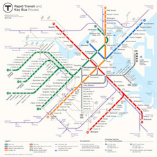]

- Monthly transportation data in Greater Boston, USA, 2007-2011.

- Monthly averages of weekday number of passengers (in thousands) by mode of transportation.

- The data is already in tidy format.

---

class: center, middle

#### Boxplots (first attempt)

.panelset[
.panel[.panel-name[All modes]

```{r echo=FALSE, message=FALSE, warning = FALSE}
mbta_tidy <- read_csv("Data/mbta_clean.csv")
mbta_tidy <- mbta_tidy %>% 
  mutate(Month = month.abb[month]) %>% # create a vector with the month abbreviations from month number
  mutate(Month = factor(Month, ordered = TRUE, levels = rev(c("Jan", "Feb", "Mar", "Apr", "May", "Jun", "Jul", "Aug", "Sep", "Oct", "Nov", "Dec"))))
```

```{r echo=FALSE, message=FALSE, warning = FALSE, fig.show='hide', eval=TRUE} 
my_labels <- c("Boat", "Bus", "Commuter \nRail", "Heavy \nRail", "Light \nRail", "Private \nBus", "RIDE", "Trackless \nTrolley")

ggplot(mbta_tidy, aes(x = mode , y = NrPassengers, color = mode)) +
  geom_boxplot() +
  labs(y = "Average weekday number of passengers (1000s)") +
  ggtitle("Boxplots of average number of passengers by travel mode") +
  theme(plot.title = element_text(hjust = 0.5)) +
  scale_x_discrete(labels= my_labels)
ggsave("Plots/mbta_boxplot_1.jpg")
```

.center[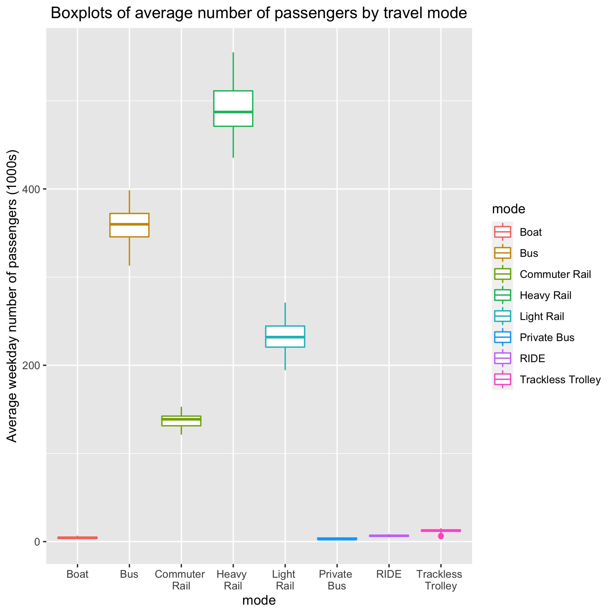]

]<!--  end of panel 1 -->

.panel[.panel-name[Least used modes]

```{r warning = FALSE, message=FALSE, echo=FALSE, fig.show='hide', eval=TRUE}
#mbta5 contains the data only for boat, private bus, RIDE and trackless trolley.
mbta5 <- filter(mbta_tidy, mode %in% c("Boat", "Private Bus", "RIDE", "Trackless Trolley"))
ggplot(mbta5, aes(x = mode , y = NrPassengers, color = mode)) +
  geom_boxplot() +
  labs(y = "Average weekday number of passengers (1000s)") +
  ggtitle("Boxplots of average number of passengers by \nboat, private bus, RIDE and trackless trolley") +
  theme(plot.title = element_text(hjust = 0.5))
ggsave("Plots/mbta_boxplot_2.jpg")
```

.center[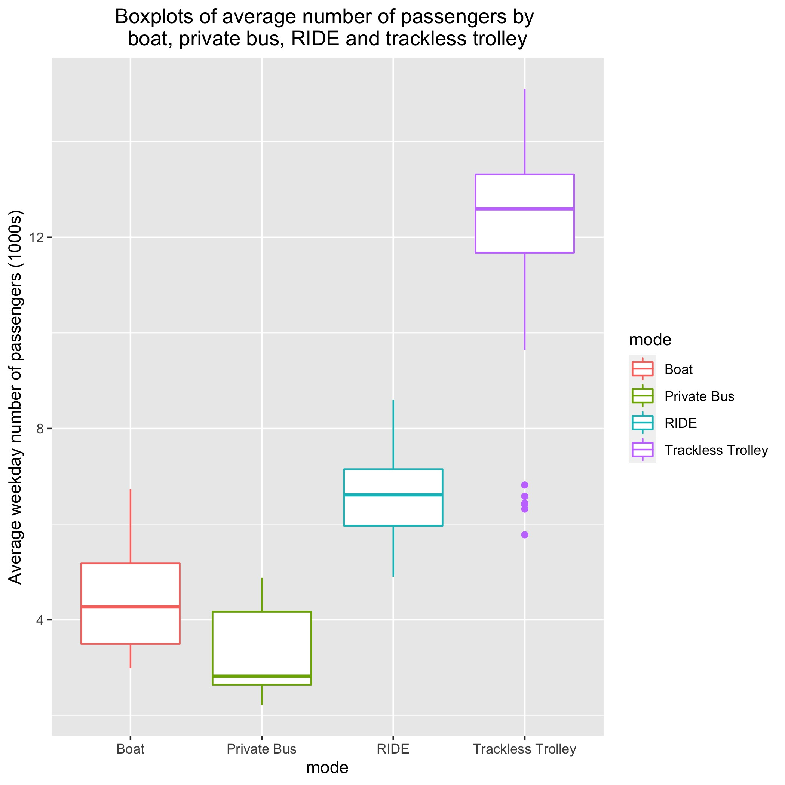]

]<!--  end of panel 2 -->

.panel[.panel-name[Most used modes]

```{r warning = FALSE, message=FALSE, echo=FALSE, fig.show='hide', eval=TRUE}
#mbta5 contains the data not boat, private bus, RIDE and trackless trolley.
mbta6 <- filter(mbta_tidy, !mode %in% c("Boat", "Private Bus", "RIDE", "Trackless Trolley"))
ggplot(mbta6, aes(x = mode , y = NrPassengers, color = mode)) +
  geom_boxplot() +
  labs(y = "Average weekday number of passengers (1000s)") +
  ggtitle("Boxplots of average number of passengers by \nboat, private bus, RIDE and trackless trolley") +
  theme(plot.title = element_text(hjust = 0.5))
ggsave("Plots/mbta_boxplot_3.jpg")
```

.center[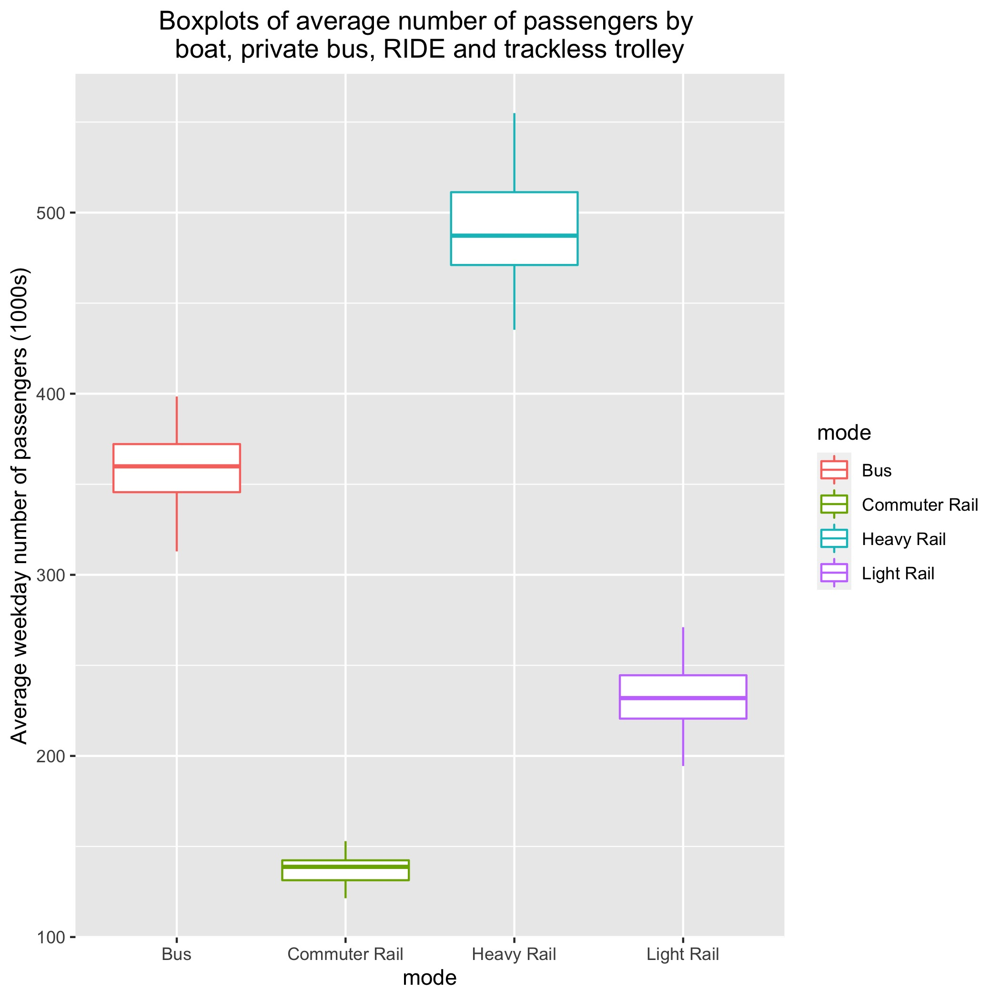]

]<!--  end of panel 3 -->


]<!--  end of panels -->

---
class: center, middle

#### Boxplots (minimal)

.panelset[
.panel[.panel-name[Least used modes]

```{r echo=FALSE, message=FALSE, warning = FALSE, fig.show='hide', eval=TRUE} 
mbta5 <- filter(mbta_tidy, mode %in% c("Boat", "Private Bus", "RIDE", "Trackless Trolley"))
ggplot(mbta5, aes(x = mode , y = NrPassengers, fill = mode)) +
  geom_boxplot() +
  labs(y = "Weekday average number of passengers (1000s)", x = "") +
  # ggtitle("Box plots of average number of passengers by \nboat, private bus, RIDE and trackless trolley") +
  theme(plot.title = element_text(hjust = 0.5)) +
  theme_bw() +
  theme(
        panel.grid.major.x = element_blank(), # remove the vertical grid lines
        panel.grid.minor.x = element_blank(), # remove the vertical grid lines
        panel.border = element_blank(), # remove the frame around the graph
        #panel.grid.major.y = element_blank(),
        #panel.grid.minor.y = element_blank(),
        legend.position = "none" # remove the legend 
      ) +
  ggtitle("Distribution of weekday average number of passengers")
ggsave("Plots/boxplot_least.jpg")
```

.center[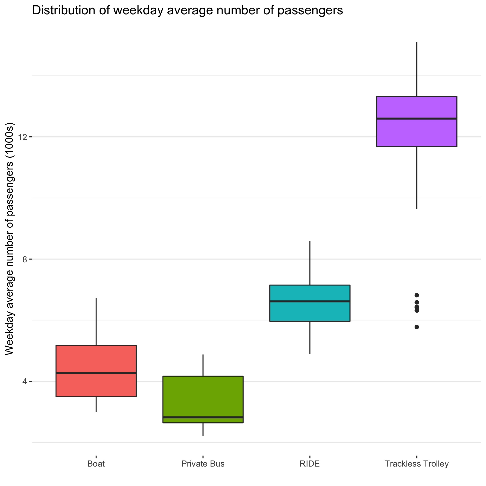]

]<!--  end of panel 1 -->

.panel[.panel-name[Most used modes]

```{r echo=FALSE, message=FALSE, warning = FALSE, fig.show='hide', eval=TRUE} 
mbta6 <- filter(mbta_tidy, !mode %in% c("Boat", "Private Bus", "RIDE", "Trackless Trolley"))
ggplot(mbta6, aes(x = mode , y = NrPassengers, fill = mode)) +
  geom_boxplot() +
  labs(y = "Weekday average number of passengers (1000s)", x = "") +
  # ggtitle("Box plots of average number of passengers by \nboat, private bus, RIDE and trackless trolley") +
  theme(plot.title = element_text(hjust = 0.5)) +
  theme_bw() +
  theme(
        panel.grid.major.x = element_blank(), # remove the vertical grid lines
        panel.grid.minor.x = element_blank(), # remove the vertical grid lines
        panel.border = element_blank(), # remove the frame around the graph
        #panel.grid.major.y = element_blank(),
        #panel.grid.minor.y = element_blank(),
        legend.position = "none" # remove the legend 
      ) +
  ggtitle("Distribution of weekday average number of passengers")
ggsave("Plots/boxplot_most.jpg")
```

.center[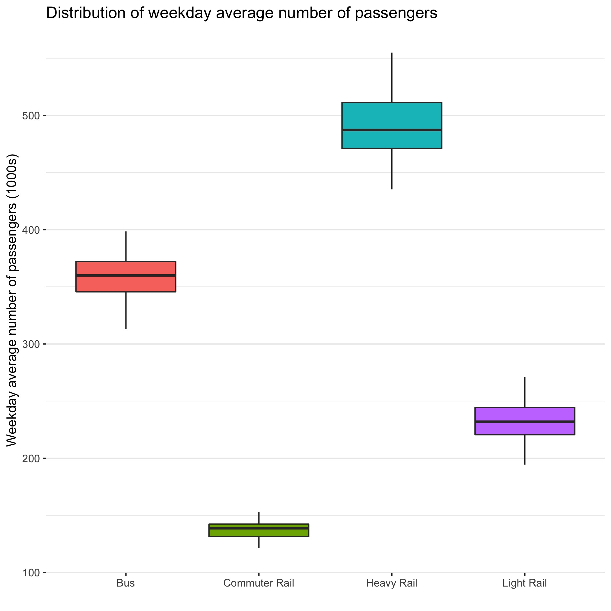]

]<!--  end of panel 2 -->


]<!--  end of panels -->

---
class: center, middle

#### Time plots (first attempt)

.panelset[
.panel[.panel-name[All modes]

```{r echo=FALSE, message=FALSE, warning = FALSE, fig.show='hide', eval=TRUE} 
 ggplot(mbta_tidy, aes(x = date, y = NrPassengers, col = mode)) +
  geom_line() +
  geom_point()+
  labs(y = "Average Weekday Number of Passengers (thousands)")
ggsave("Plots/time_plot1.jpg")
```

.center[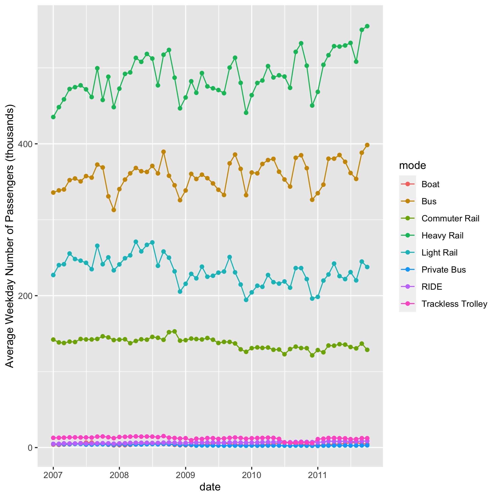]

]<!--  end of panel 1 -->

.panel[.panel-name[Least used modes]

```{r echo=FALSE, message=FALSE, warning = FALSE, fig.show='hide', eval=TRUE} 
mbta5 <- filter(mbta_tidy, mode %in% c("Boat", "RIDE", "Trackless Trolley", "Private Bus"))#this selects the rows corresponding to passengers who traveled by boat, car, trackless trolley and private bus
ggplot(mbta5, aes(x = date, y = NrPassengers, col = mode)) +
  geom_line() +
  geom_point() +
  labs(y = "Average Weekday Number of Passengers (thousands)")
ggsave("Plots/time_plot2.jpg")
```

.center[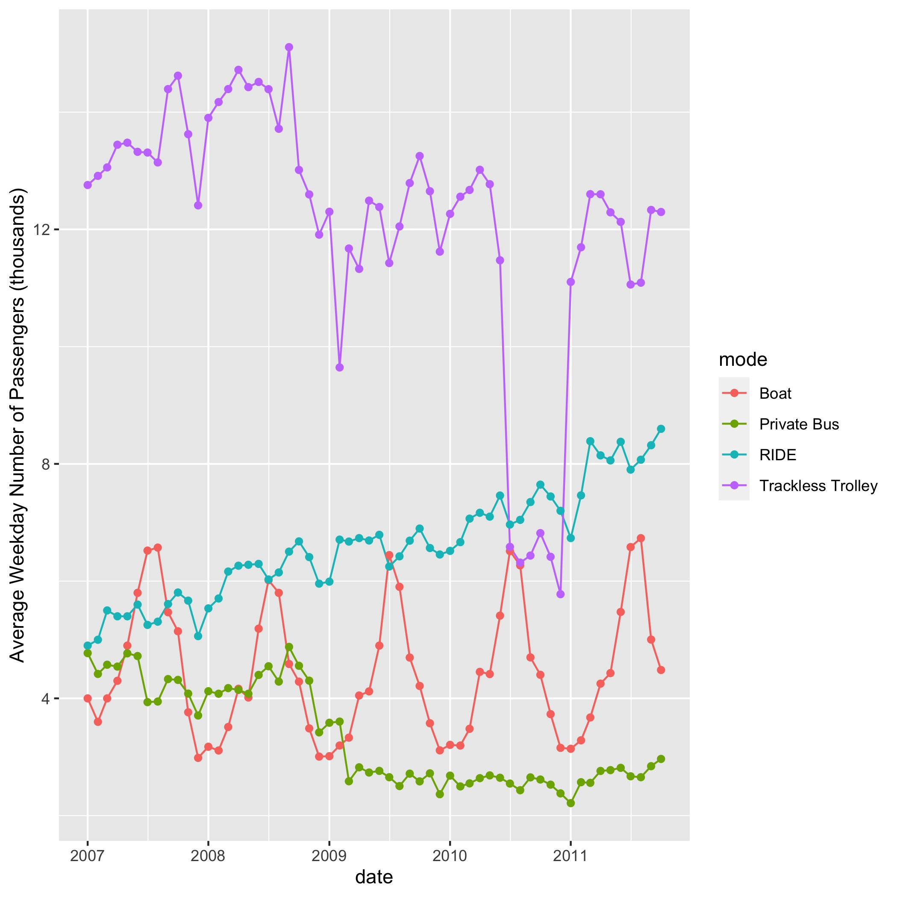]

]<!--  end of panel 2 -->

.panel[.panel-name[Most used modes]

```{r echo=FALSE, message=FALSE, warning = FALSE, fig.show='hide', eval=TRUE} 
mbta5 <- filter(mbta_tidy, !mode %in% c("Boat", "RIDE", "Trackless Trolley", "Private Bus"))#this selects the rows corresponding to passengers who traveled by boat, car, trackless trolley and private bus
ggplot(mbta5, aes(x = date, y = NrPassengers, col = mode)) +
  geom_line() +
  geom_point() +
  labs(y = "Average Weekday Number of Passengers (thousands)")
ggsave("Plots/time_plot3.jpg")
```

.center[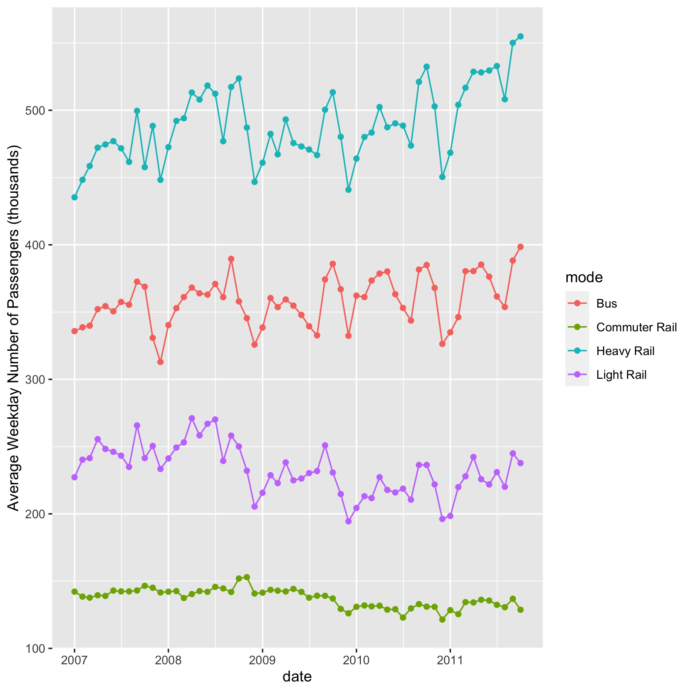]

]<!--  end of panel 3 -->


]<!--  end of panels -->

---
class: center, middle

#### Time plots (minimal)

.panelset[
.panel[.panel-name[Least used modes]

```{r echo=FALSE, message=FALSE, warning = FALSE, fig.show='hide', eval=TRUE} 
mbta5 <- filter(mbta_tidy, mode %in% c("Boat", "RIDE", "Trackless Trolley", "Private Bus"))#this selects the rows corresponding to passengers who traveled by boat, car, trackless trolley and private bus
ggplot(mbta5, aes(x = date, y = NrPassengers, col = mode)) +
  geom_line() +
  geom_point() +
  labs(y = "Weekday Average Number of Passengers (thousands)", x = "") +
  theme_bw() +
  theme(
        panel.grid.major.x = element_blank(), # remove the vertical grid lines
        panel.grid.minor.x = element_blank(), # remove the vertical grid lines
        panel.border = element_blank() # remove the frame around the graph
        #panel.grid.major.y = element_blank(),
        #panel.grid.minor.y = element_blank()
      ) +
  theme(legend.title=element_blank()) # remove the legend title
ggsave("Plots/time_plot4.jpg")
```

.center[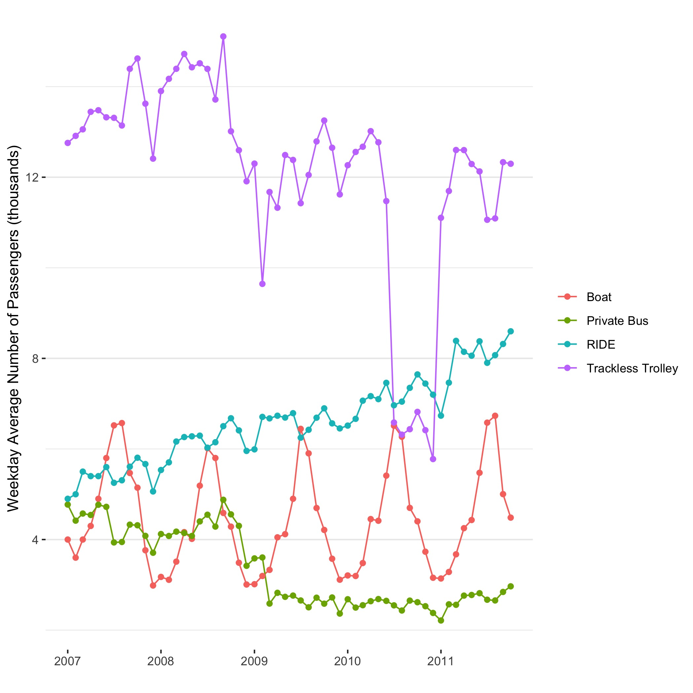]

]<!--  end of panel 1 -->

.panel[.panel-name[Most used modes]

```{r echo=FALSE, message=FALSE, warning = FALSE, fig.show='hide', eval=TRUE}
mbta5 <- filter(mbta_tidy, !mode %in% c("Boat", "RIDE", "Trackless Trolley", "Private Bus"))#this selects the rows corresponding to passengers who traveled by boat, car, trackless trolley and private bus
ggplot(mbta5, aes(x = date, y = NrPassengers, col = mode)) +
  geom_line() +
  geom_point() +
  labs(y = "Weekday Average Number of Passengers (thousands)", x = "") +
  theme_bw() +
  theme(
        panel.grid.major.x = element_blank(), # remove the vertical grid lines
        panel.grid.minor.x = element_blank(), # remove the vertical grid lines
        panel.border = element_blank() # remove the frame around the graph
        #panel.grid.major.y = element_blank(),
        #panel.grid.minor.y = element_blank()
      ) +
  theme(legend.title=element_blank()) # remove the legend title
ggsave("Plots/time_plot5.jpg")
```

.center[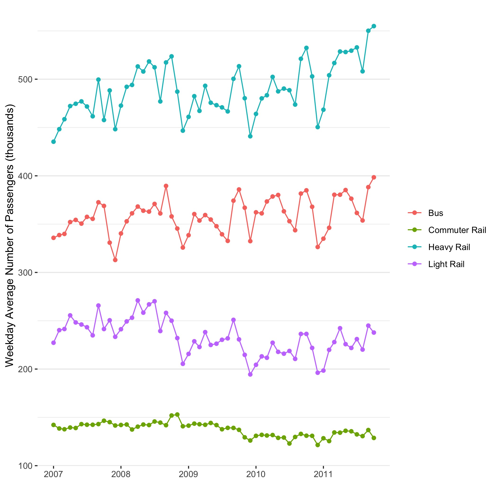]

]<!--  end of panel 2 -->


]<!--  end of panels -->

---
class: center, middle

#### Bar charts

.panelset[
.panel[.panel-name[Stacked]

```{r echo=FALSE, message=FALSE, warning = FALSE, eval=TRUE}
data_boat_trlessTroll <- mbta_tidy %>% 
  group_by(mode, Month) %>% 
  summarize(average_nr_passengers = mean(NrPassengers)) %>%
  filter(mode %in% c("Boat", "Trackless Trolley")) 
```

```{r boattrolley, echo=FALSE, message=FALSE, warning = FALSE, fig.show='hide', eval=TRUE}
data_boat_trlessTroll%>%
  ggplot(aes(x = Month, y = average_nr_passengers, fill = mode)) +
  geom_bar(stat = "identity") + 
  coord_flip() +
  geom_text(aes(label=round(average_nr_passengers, 2)), position = position_stack(0.5)) +
  labs(y = " ", x= "") +
  theme_bw() +
  theme(
        panel.grid.major.x = element_blank(), # remove the vertical grid lines
        panel.grid.minor.x = element_blank(), # remove the vertical grid lines
        panel.border = element_blank(), # remove the frame around the graph
        #panel.grid.major.y = element_blank(),
        #panel.grid.minor.y = element_blank(),
        axis.text.x=element_blank(),
        axis.ticks.x=element_blank()
      ) +
  theme(legend.title=element_blank()) +  # remove the legend title
  ggtitle("Weekday Average Number of passengers (thousands)")
ggsave("Plots/stacked_barchart.jpg")
```

.center[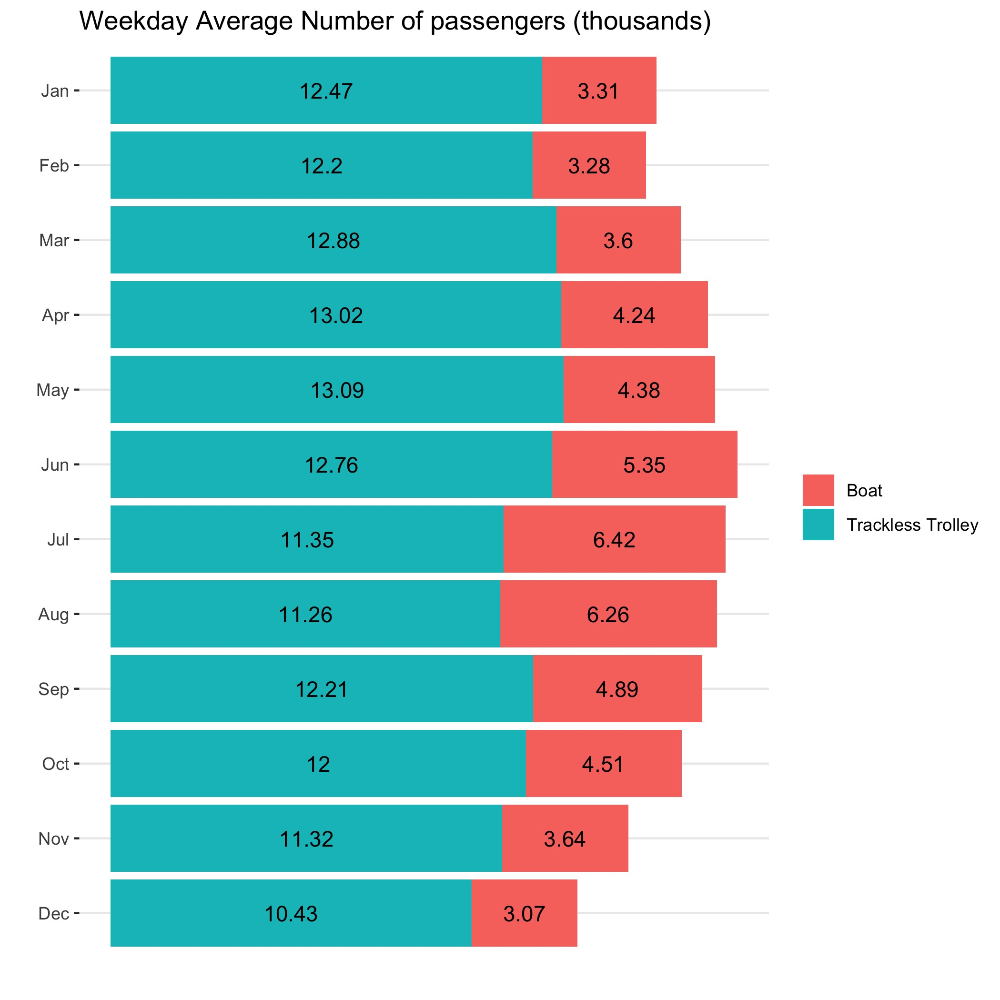]


]<!--  end of panel 1 -->

.panel[.panel-name[Grouped]

```{r echo=FALSE, message=FALSE, warning = FALSE, fig.show='hide', eval=TRUE}
data_boat_trlessTroll %>%
  mutate(Month = factor(Month, ordered = TRUE, levels = month.abb)) %>%
  ggplot(aes(x = Month, y = average_nr_passengers, fill = mode)) +
  geom_bar(stat = "identity", position = position_dodge()) +
  geom_text(aes(label=round(average_nr_passengers, 1)), position = position_dodge(0.8), vjust = 1.5, 
            hjust = .5, size=3) +
  theme_bw() +
  labs(y = " ", x = " ") +
  theme(
        panel.grid.major.x = element_blank(), # remove the vertical grid lines
        panel.grid.minor.x = element_blank(), # remove the vertical grid lines
        panel.border = element_blank(), # remove the frame around the graph
        panel.grid.major.y = element_blank(),
        panel.grid.minor.y = element_blank(),
        axis.text.y=element_blank(),
        axis.ticks.y=element_blank()
          ) +
  theme(legend.title=element_blank()) +  # remove the legend title
  ggtitle("Weekday Average Number of passengers (thousands)")
ggsave("Plots/grouped_barchart.jpg")
```

.center[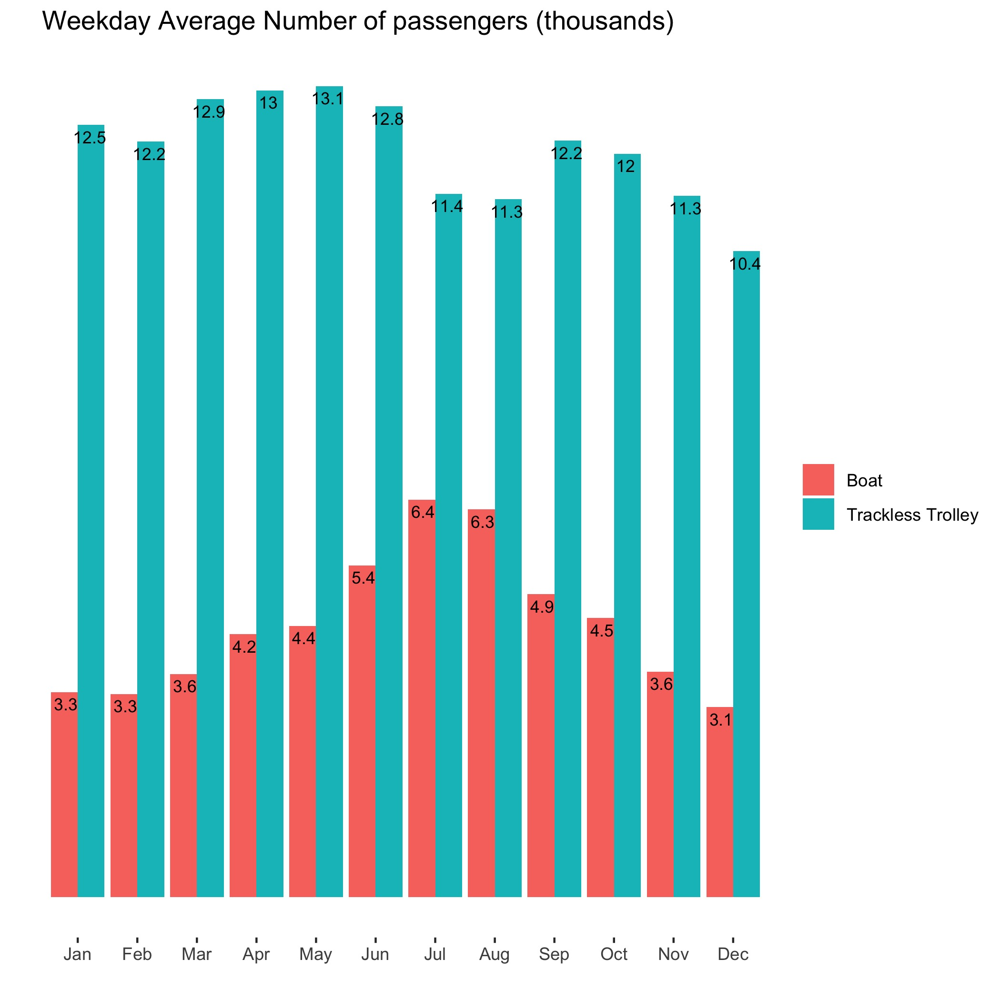]

]<!--  end of panel 2 -->


]<!--  end of panels -->

---

#### Discuss the merits of the following barchart displaying the times (in seconds) from the men’s 100 meter final in the 2016 Olympics.

```{r echo=FALSE, message=FALSE, warning=FALSE, fig.show='hide', eval=TRUE}
library(forcats)
olympics_sprint_data <- read_csv("Data/olympics_sprint_data.csv")

olympics_sprint_data %>%
  mutate(name = fct_reorder(name, -time)) %>% 
  ggplot(mapping = aes(x = time, y = name)) +
  geom_col()
ggsave("Plots/bad_barchart.jpg")
```

.center[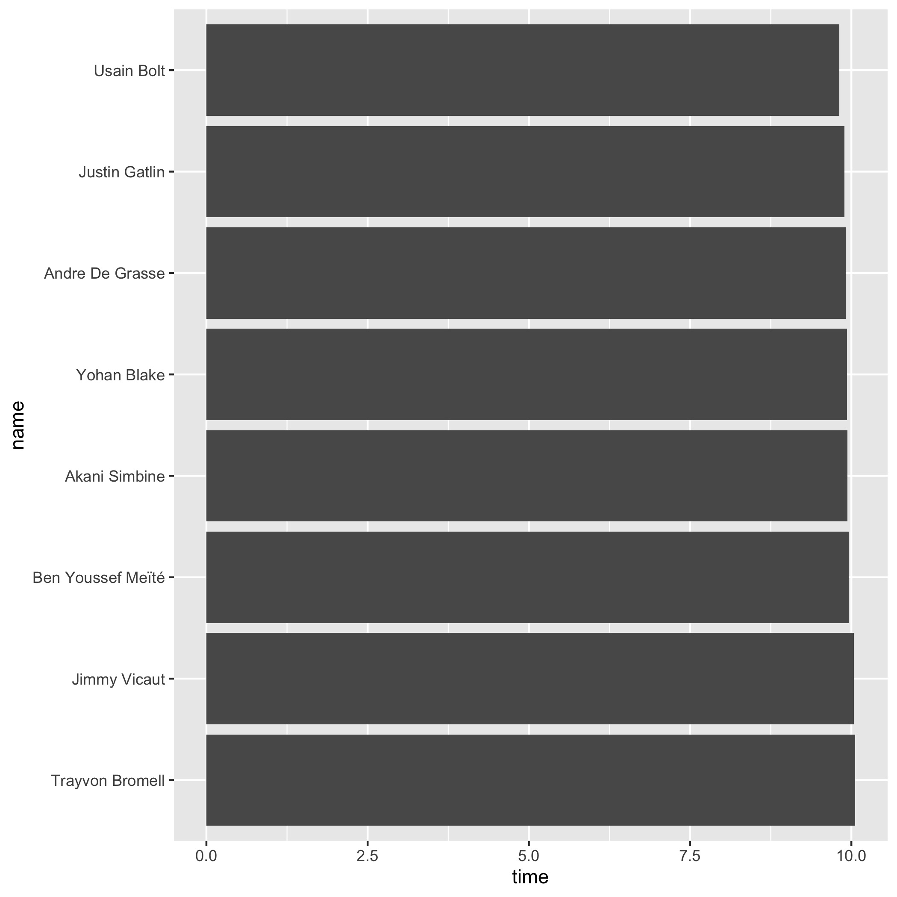]

---

## Case study: Association of qualitative variables. 

### Berkeley admissions data

- Graduate admission figures for the Autumn of 1973 at the University of California, Berkeley. 

- The numbers,  seem to imply that men applying for post-graduate studies were more likely than women to be admitted. 


```{r echo=FALSE, message=FALSE, warning = FALSE}
Applicants <- c(8442, 4321)
Admitted <- c("44%", "35%")
Berk_messy1 <- cbind(Applicants, Admitted)
row.names(Berk_messy1) <- c("Men", "Women")

kable(Berk_messy1,align='ccc') %>% #, caption = "Berkeley admissions data by gender and admission status") %>%
  kable_styling(bootstrap_options = c("striped", "condensed"), full_width = F)
```

- It was argued that the difference was so large that it was unlikely to be due to chance.

.center[]

---

- The data above has been aggregated through departments. 

- It is known that different genders have different preferences of departments they apply to.

- The data from the six largest departments are listed below.

```{r echo=FALSE, message=FALSE, warning = FALSE}
Applied_men <- c(825, 560, 325, 417, 191, 373)
Admitted_men <- c("62%", "63%", "37%", "33%", "28%", "6%")
Applied_women <- c(108, 25, 593, 375, 393, 341)
Admitted_women <- c("82%", "68%", "34%", "35%", "24%", "7%")
Department <- c("A", "B", "C", "D", "E", "F")
Berk_messy2 <- data.frame(Department, Applied_men, Admitted_men, Applied_women, Admitted_women)
#Berk_messy2 <- as.data.frame(Berk_messy2, stringsAsFactors = F)
kable(Berk_messy2, align = 'ccccc') %>% #, caption = "Berkeley admissions data with admissions status by department") %>%
  kable_styling(bootstrap_options = c("striped", "condensed"), full_width = F)
```

---
class: center, middle


### Mosaic plot (using vcd package)

```{r echo=FALSE, message=FALSE, warning = FALSE}
Berk_tidy2 <- read_csv("Data/BerkeleyDataTidy.csv")
Berk_tidy2 <- Berk_tidy2 %>%
  rename(`Admission Status` = AdmissionStatus)
```

```{r echo=FALSE, message=FALSE, warning = FALSE}
# create a contingency table
aux2 <- xtabs(number ~ Department + `Admission Status` + Gender, data = Berk_tidy2) 
mosaic(aux2, highlighting = "Gender", highlighting_fill = c("pink", "lightblue"))
```


---

- The heights and lengths of each mosaic are proportional to the proportions in the margins. 

- A flat rectangle indicates very few applicants of the corresponding gender in a given department. 

- A long rectangle in the admitted status indicates that it's not so difficult to be accepted in the corresponding department.  

- There is no evidence for a discrimination case. 

- Most selective departments have more female applicants. 


---

- One of the perils when studying associations between a variable of interest and a set of explanatory variables is **overfitting**. 

--

- If we use too many explanatory variables we may explain very well the observed values of the variable of interest but nothing else and so our study will have little predictive value.

--

- Problems also occur when relevant explanatory variables are ignored.

--

- It is possible that when one ignores a relevant variable one observes an effect and when the variable is considered the opposite effect is observed. This is called **Simpson's paradox**.

--

- What we have explored with the Berkeley graduate admissions data is one of the best-known examples of Simpson's paradox.

---
class: center, middle

###  Treemap

```{r echo=FALSE, message=FALSE, warning = FALSE}
Berk <- Berk_tidy2 %>% 
  mutate(Department = paste("Dep", Department))
```

```{r echo=FALSE, message=FALSE, warning = FALSE}
#library(treemap)
treemap(Berk, #Your data frame object
        index=c("Department", "Admission Status", "Gender"),  #A list of your categorical variables
        vSize = "number",  #This is your quantitative variable
        type="index", #Type sets the organization and color scheme of your treemap
        #palette = "Reds",  #Select your color palette from the RColorBrewer presets or make your own.
        
        title="Admission status by department and gender at UC Berkeley", #Customize your title
        #fontsize.title = 14 #Change the font size of the title
        )
```

---

- Like mosaic plots, a treemap visually displays proportions by varying the area of a rectangular shape. 

--

- The data you need is:
  - A  quantitative variable that has positive values. This will be used to calculate the area of the rectangles in the treemap.
  - One or more categorical variables associated with that quantitative variable allowing to group the data hierarchically.

- In the Berkeley admission data, the quantitative variable is "Number admitted". 

--

- The categorical variables are "Department", "Admission Status", and "Gender", with that order of nesting (i.e. Gender within Admission Status within Department).

--

- Note that the nesting or hierarchy is not always unique. Therefore, you must think about what information you want to display and which nesting is most adequate.

--

- For example, you could have procurement in government departments and each department has individual projects with a cost. There is only one natural hierarchy here, namely project within department.

---

## Case study: other ways of showing variation in time

### HIV prevalence

- Data about Adults with HIV in Africa (estimated prevalence of HIV in percentage, ages 15-49) from Gapminder.org, 1990-2011.

- Yearly HIV prevalence by country as well as income (GDP per capita, PPP$ inflation-adjusted) and population size. 

.center[]

---

### **Faceted Scatter plots**

.panelset[
.panel[.panel-name[First attempt]

```{r echo=FALSE, message=FALSE, warning = FALSE}
HIV_Inc_Cont <- read_csv("Data/HIV_clean.csv")
```

```{r echo=FALSE, message=FALSE, warning = FALSE}
aux <- filter(HIV_Inc_Cont, Year %in% c("1990", "1995", "2000", "2005", "2011"))
```

```{r echo=FALSE, message=FALSE, warning = FALSE, fig.show='hide'}
aux %>% 
  ggplot(aes(x = Income, y = PrevalenceHIV, col = four_regions) ) + 
  geom_point(alpha = 0.8) + 
  #scale_x_log10() +
  labs(x = "GDP per capita (US$) - inflation adjusted" ) +
  labs(y = "Estimated HIV prevalence (%)" ) +
  theme(legend.title=element_blank()) +
  ggtitle("Plot of HIV prevalence vs income - all nations") +
  facet_grid(.~Year) + # one plot for each of the desired years
  theme(legend.position = "bottom")
ggsave("Plots/HIV_init.jpg")
```

.center[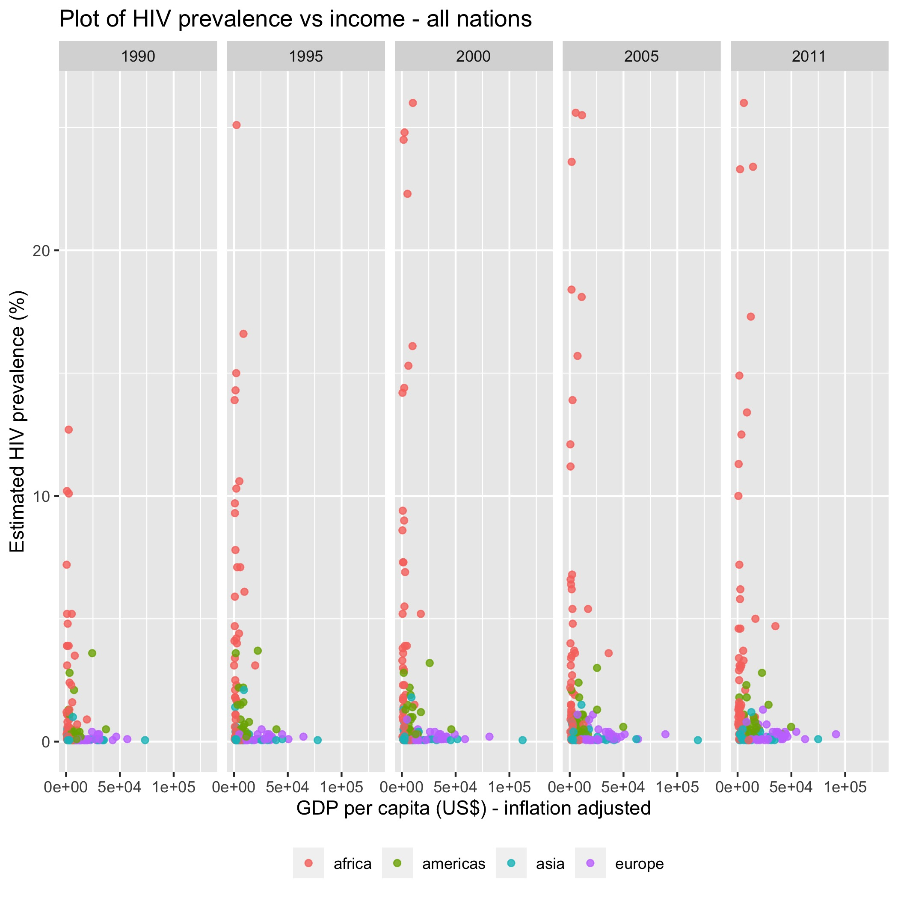]

]

.panel[.panel-name[Second attempt]

```{r echo=FALSE, message=FALSE, warning = FALSE, fig.show='hide'}
aux %>% 
  ggplot(aes(x = Income, y = PrevalenceHIV, col = four_regions) ) + 
  geom_point(alpha = 0.8) + 
  scale_x_log10() +
  labs(x = "GDP per capita (log10 $) - inflation adjusted" ) +
  labs(y = "Estimated HIV prevalence (%)" ) +
  theme(legend.title=element_blank()) +
  #ggtitle("Plot of HIV prevalence vs income - all nations") +
  facet_grid(.~Year) + # one plot for each of the desired years
  theme(legend.position = "bottom")
ggsave("Plots/HIV_xlog.jpg")
```

.center[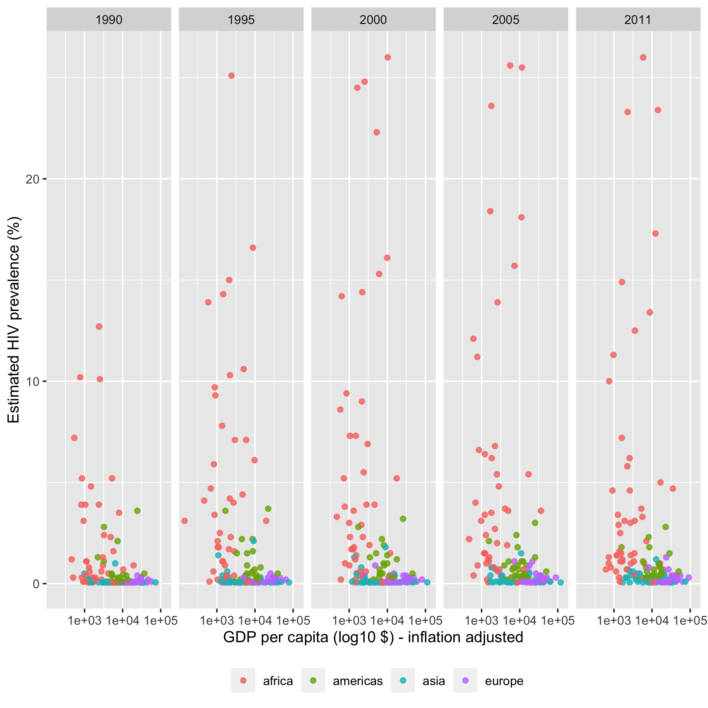]

]

.panel[.panel-name[Third attempt]

```{r echo=FALSE, message=FALSE, warning = FALSE, eval=TRUE, fig.show='hide'}
aux %>% 
  ggplot(aes(x = Income, y = PrevalenceHIV, col = four_regions) ) + 
  geom_point(alpha = 0.8) + 
  scale_x_log10() +
  labs(x = "GDP per capita (log10 - $thousands) - inflation adjusted" ) +
  labs(y = "Estimated HIV prevalence (%)" ) +
  theme(legend.title=element_blank()) +
  #ggtitle("Plot of HIV prevalence vs income - all nations") +
  facet_grid(.~Year) + # one plot for each of the desired years
  theme(legend.position = "bottom") +
  scale_x_log10(breaks=c(1000,10000,100000),labels=c("1,000", "10,000", "100,000")) +
  theme(axis.text.x = element_text(size = 7.5)) # this makes the tickmark labels smaller so they don't overlap
ggsave("Plots/HIV_third.jpg")
```

.center[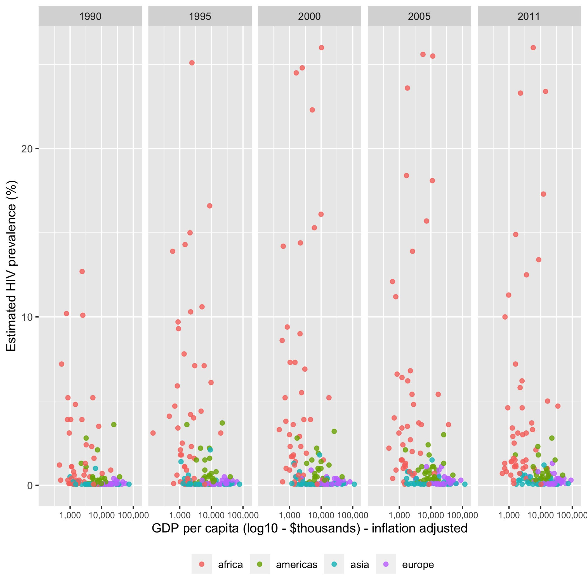]

]

]

---

### **Faceted Scatter plots - Africa**

.panelset[
.panel[.panel-name[First attempt]

```{r echo=FALSE, message=FALSE, warning = FALSE, eval=TRUE, fig.show='hide'}
#Only Africa
aux2 <- filter(aux, four_regions == "africa")# we further filter the data to select only countries in Africa
p_africa <- ggplot(aux2, aes(x = Income, y = PrevalenceHIV) ) + 
  geom_point(alpha = 0.8, show.legend = FALSE) +
  scale_x_log10() +
  labs(x = "GDP per capita (log10 $) - inflation adjusted" ) +
  labs(y = "Estimated HIV prevalence (%)" ) +
  #ggtitle("Plot of HIV prevalence vs income - Africa") +
  facet_grid(.~Year) +
  scale_x_log10(breaks=c(300,1000,3000, 10000, 30000),labels=c("300", "1000", "3000", "10000", "30000")) +
  theme(axis.text.x = element_text(size = 5.8)) # this makes the tickmark labels smaller so they don't overlap
ggsave("Plots/HIV_africa1.jpg")    
```

.center[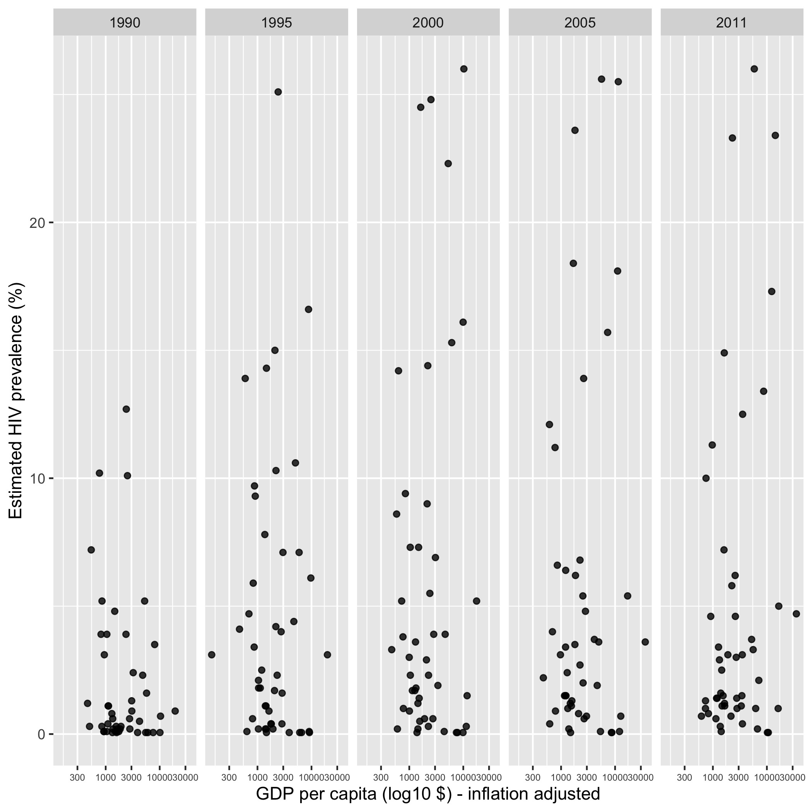]

]

.panel[.panel-name[Second attempt]

```{r echo=FALSE, message=FALSE, warning = FALSE, eval=TRUE}
#for year 1990
x_90 <- filter(aux2, PrevalenceHIV >= 10 & Year == "1990") #further filter the data selecting prevalence>=10 and year 1990
#select(x_90, 1:5)

#for year 1995
x_95 <- filter(aux2, PrevalenceHIV >= 10 & Year == "1995")
#select(x_95, 1:5)

#for year 2000
x_00 <- filter(aux2, PrevalenceHIV >= 10 & Year == "2000")
#select(x_00, 1:5)

#for year 2005
x_05 <- filter(aux2, PrevalenceHIV >= 10 & Year == "2005")
#select(x_05, 1:5) 

#for year 2011
x_11 <- filter(aux2, PrevalenceHIV >= 10 & Year == "2011")
#select(x_11, 1:5)
```

```{r echo=FALSE, message=FALSE, warning = FALSE, eval=TRUE, fig.show='hide'}
#Let us add the names of the countries with high HIV prevalence to the plots.
#library(ggrepel)

p_africa + 
             geom_text_repel(data = x_90, aes(label = geo) , col = "blue", size = 3) +
             geom_text_repel(data = x_95, aes(label = geo) , col = "blue", size = 3) +
             geom_text_repel(data = x_00, aes(label = geo) , col = "blue", size = 3) +
             geom_text_repel(data = x_05, aes(label = geo) , col = "blue", size = 3) +
             geom_text_repel(data = x_11, aes(label = geo) , col = "blue", size = 3) 
ggsave("Plots/HIV_africa2.jpg")
```

.center[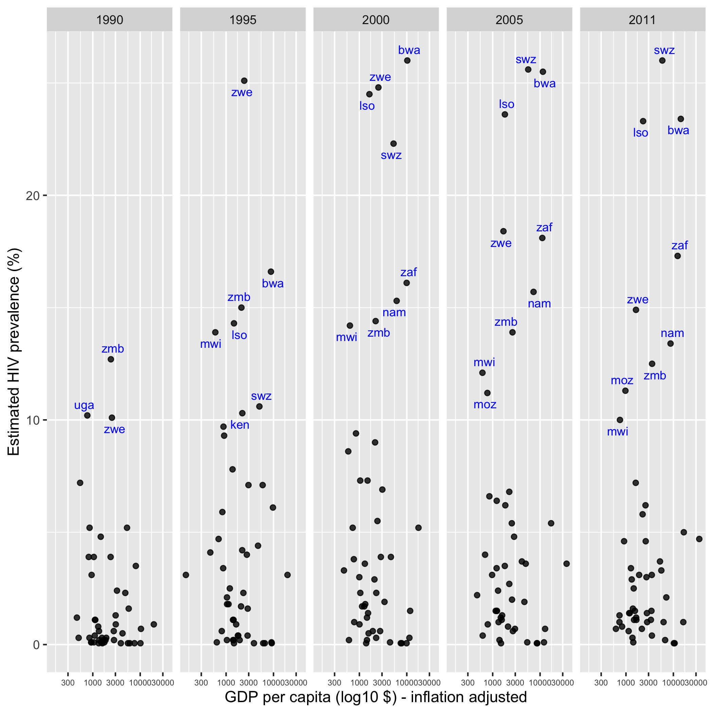]


]

.panel[.panel-name[Third attempt]

```{r echo=FALSE, message=FALSE, warning = FALSE, eval=TRUE, fig.show='hide'}
#Let us add the names of the countries with high HIV prevalence to the plots.

p_africa + 
  geom_text_repel(data = x_90, aes(label = geo) , col = "blue", size = 3) +
  geom_text_repel(data = x_95, aes(label = geo) , col = "blue", size = 3) +
  geom_text_repel(data = x_00, aes(label = geo) , col = "blue", size = 3) +
  geom_text_repel(data = x_05, aes(label = geo) , col = "blue", size = 3) +
  geom_text_repel(data = x_11, aes(label = geo) , col = "blue", size = 3) +
  theme_bw() +
  theme(
    panel.grid.major.x = element_blank(), # remove the vertical grid lines
    panel.grid.minor.x = element_blank(), # remove the vertical grid lines
        #panel.border = element_blank() # remove the frame around the graph
        #panel.grid.major.y = element_blank(),
        #panel.grid.minor.y = element_blank()
    ) +
   theme(axis.text.x = element_text(size = 5.7)) # this makes the tickmark labels smaller so they don't overlap
ggsave("Plots/HIV_africa3.jpg")
```

.center[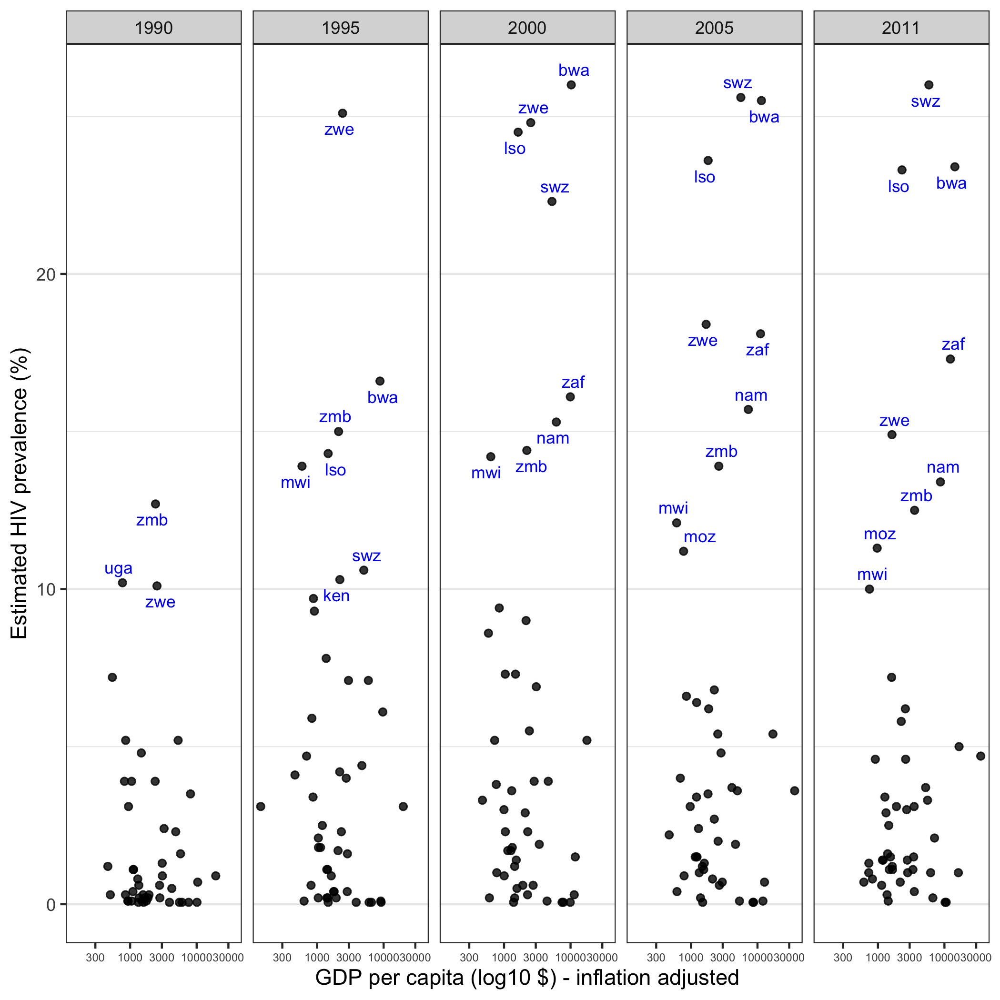]

]

]

---

### Animated scatterplots

.panelset[
.panel[.panel-name[Prevalence and GDP]

```{r echo=FALSE, message=FALSE, warning = FALSE, eval=FALSE}
library(gganimate)
p_anim_africa <- 
  ggplot(filter(HIV_Inc_Cont, four_regions == "africa"), 
  aes(x = Income, y = PrevalenceHIV) ) +
  geom_point(show.legend = FALSE, size = 2, alpha = 0.5, color = "black") +
  geom_text_repel(aes(label = geo), color = "blue", seed = 123) +
  scale_x_log10() +
  theme_bw() + #background colour is white
  theme(
        panel.grid.major.x = element_blank(), # remove the vertical grid lines
        panel.grid.minor.x = element_blank(), # remove the vertical grid lines
        panel.border = element_blank() # remove the frame around the graph
        #panel.grid.major.y = element_blank(),
        #panel.grid.minor.y = element_blank()
      ) +
  labs(x = "GDP per capita (log10)", y = "HIV prevalence") + #up to here it's a static plot
  transition_states(Year) + #this indicates one frame per year
  labs(title = "HIV prevalence in Africa - Year: {closest_state}") #this places a title on each frame with the year
#
animate(p_anim_africa, end_pause = 15, duration = 40)
anim_save("Plots/africa_animation.gif")
```

.center[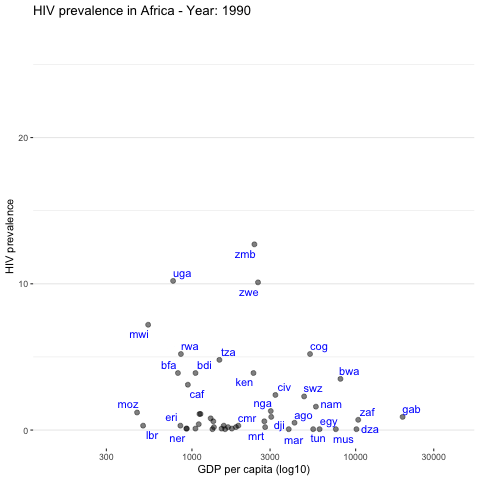]

]

.panel[.panel-name[Prevalence, GDP and Population]

```{r echo=FALSE, message=FALSE, warning = FALSE, eval=FALSE}
p_anim_africa_2 <- 
  ggplot(filter(HIV_Inc_Cont, four_regions == "africa"), 
         aes(x = Income, y = PrevalenceHIV, size = population/1000000) ) +
  geom_point(show.legend = TRUE, alpha = 0.5, color = "black") +
  geom_text_repel(aes(label = geo), size = 4, color = "blue", seed = 123) + #I add size here otherwise the labels will be proportional to population size as well
  scale_x_log10() +
  guides(size=guide_legend(title="Population (millions)")) +
  theme_bw() + #background colour is white
  theme(
        panel.grid.major.x = element_blank(), # remove the vertical grid lines
        panel.grid.minor.x = element_blank(), # remove the vertical grid lines
        panel.border = element_blank() # remove the frame around the graph
        #panel.grid.major.y = element_blank(),
        #panel.grid.minor.y = element_blank()
      ) +
  labs(x = "GDP per capita (log10)", y = "HIV prevalence") + #up to here it's a static plot
  transition_states(Year) + #this indicates one frame per year
  labs(title = "HIV prevalence in Africa - Year: {closest_state}") #this places a title on each frame with the year
#
animate(p_anim_africa_2, end_pause = 15, duration = 40)
anim_save("Plots/africa_animation2.gif")
```

.center[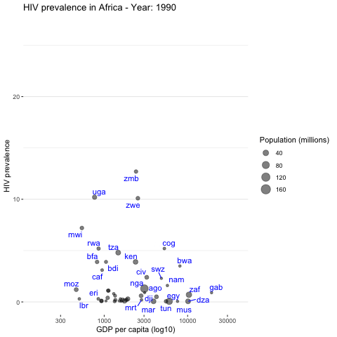]

]

]

---

### **Connected scatter plot** - Equatorial Guinea

.panelset[
.panel[.panel-name[Plain scatter plot]

```{r echo=FALSE, message=FALSE, warning = FALSE, eval=TRUE, fig.show='hide'}
# data
data_gnq <- HIV_Inc_Cont %>%
  filter(geo == "gnq") # data for Equatorial Guinea


data_gnq %>%
  ggplot(
    aes(x = Income, y = PrevalenceHIV, label = Year) 
    ) +
  geom_line() +
  geom_point() +
  theme_bw() +
  labs(y = "HIV Prevalence (%)", x = "GDP") +
  theme(
        panel.grid.major.x = element_blank(), # remove the vertical grid lines
        panel.grid.minor.x = element_blank(), # remove the vertical grid lines
        panel.border = element_blank() # remove the frame around the graph
        #panel.grid.major.y = element_blank(),
        #panel.grid.minor.y = element_blank()
      ) +
  ggtitle("Income and HIV prevalence in Equatorial Guinea, 1990-2011")
ggsave("Plots/connected_scatter1.jpg")
```

.center[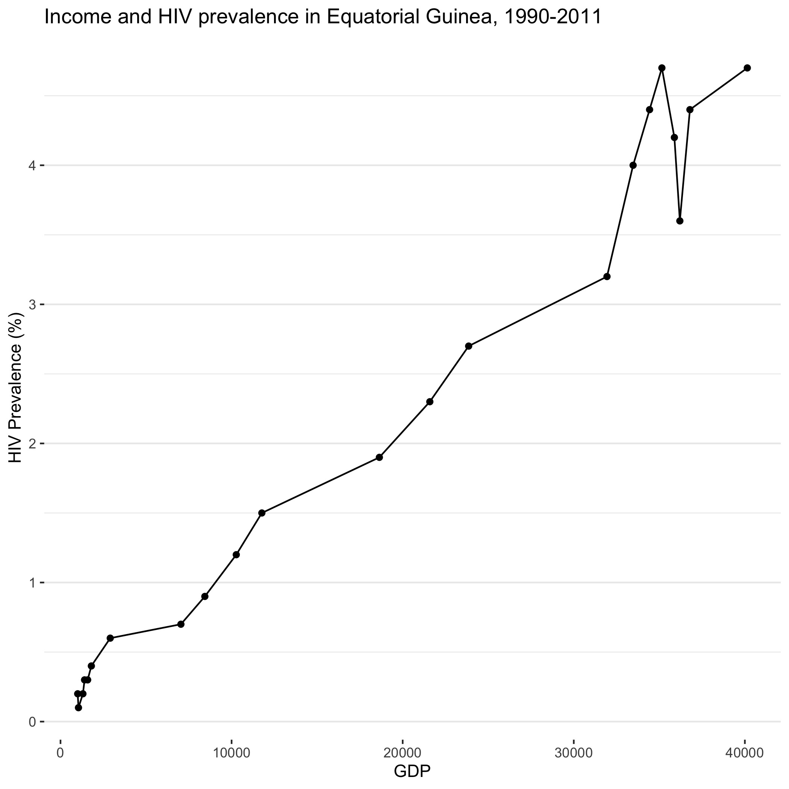]

]

.panel[.panel-name[Connected scatter plot]

```{r echo=FALSE, message=FALSE, warning = FALSE, eval=TRUE, fig.show='hide'}
# data
data <- HIV_Inc_Cont %>%
  filter(geo == "gnq") # data for Equatorial Guinea

tmp_date <-  data %>% sample_frac(0.3)

data %>%
  ggplot(
    aes(x = Income, y = PrevalenceHIV, label = Year) 
    ) +
  geom_text_repel(data=tmp_date) +
  geom_segment(color="#69b3a2", 
                  aes(
                    xend=c(tail(Income, n=-1), NA), 
                    yend=c(tail(PrevalenceHIV, n=-1), NA)
                  ),
                  arrow=arrow(length=unit(0.3,"cm"))
      ) +
  theme_bw() +
  labs(y = "HIV Prevalence (%)", x = "GDP") +
  theme(
        panel.grid.major.x = element_blank(), # remove the vertical grid lines
        panel.grid.minor.x = element_blank(), # remove the vertical grid lines
        panel.border = element_blank() # remove the frame around the graph
        #panel.grid.major.y = element_blank(),
        #panel.grid.minor.y = element_blank()
      ) +
  ggtitle("Income and HIV prevalence in Equatorial Guinea, 1990-2011")
ggsave("Plots/connected_scatter2.jpg")
```

.center[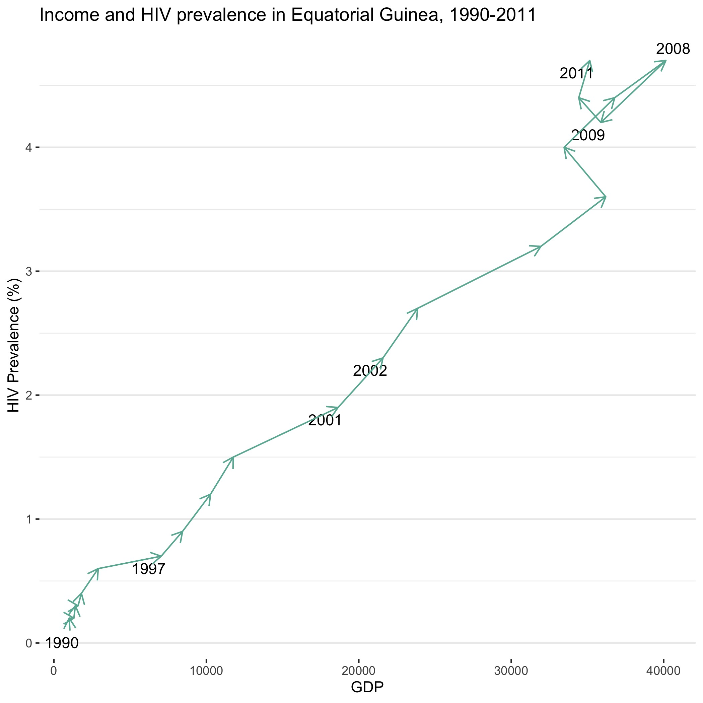]

]

.panel[.panel-name[Connected scatter plot - focused]

```{r echo=FALSE, message=FALSE, warning = FALSE, eval=TRUE, fig.show='hide'}
# data
data <- HIV_Inc_Cont %>%
  filter(geo == "gnq", Year >= 2004) # data for Equatorial Guinea from 2004

tmp_date <-  data %>% sample_frac(1)

data %>%
  ggplot(
    aes(x = Income, y = PrevalenceHIV, label = Year) 
    ) +
  geom_text_repel(data = tmp_date) +
  geom_segment(color="#69b3a2", 
                  aes(
                    xend=c(tail(Income, n=-1), NA), 
                    yend=c(tail(PrevalenceHIV, n=-1), NA)
                  ),
                  arrow=arrow(length=unit(0.3,"cm"))
      ) +
  theme_bw() +
  theme(
        panel.grid.major.x = element_blank(), # remove the vertical grid lines
        panel.grid.minor.x = element_blank(), # remove the vertical grid lines
        panel.border = element_blank() # remove the frame around the graph
        #panel.grid.major.y = element_blank(),
        #panel.grid.minor.y = element_blank()
      ) +
  labs(y = "HIV Prevalence (%)", x = "GDP") +
  ggtitle("Income and HIV prevalence in Equatorial Guinea, 2004-2011")
ggsave("Plots/connected_scatter3.jpg")
```

.center[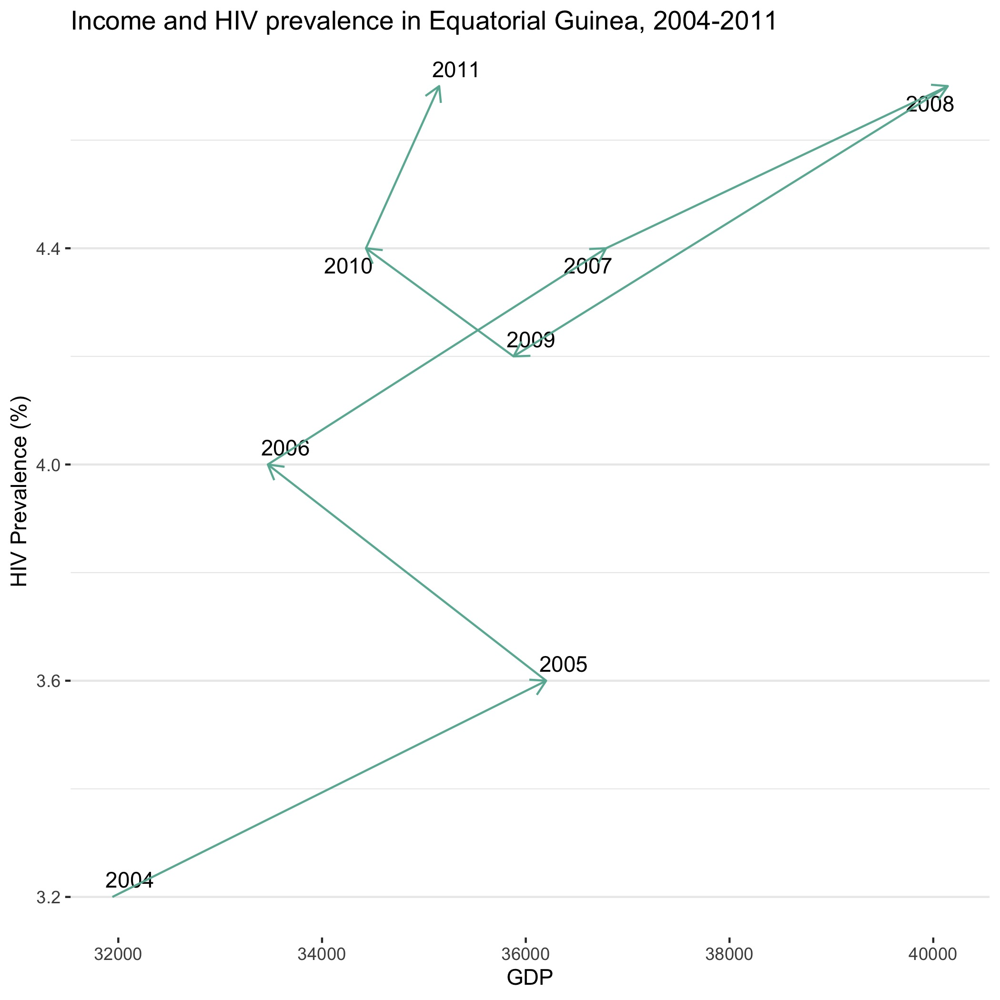]

]

]

---

### **Choropleth maps**

.panelset[
.panel[.panel-name[Static]

```{r echo=FALSE, message=FALSE, warning = FALSE, eval=TRUE, fig.show='hide'}
hiv_full <- read_csv("Data/hiv_map_data.csv")
latest_year <- 2010
current_continent <- "Africa"
hiv_latest_year <- hiv_full %>% 
  filter(year == latest_year, continent == current_continent)
#
current_continent_countries <- hiv_latest_year %>% 
  pull(country)
#
hiv_data <- map_data("world") %>% 
  filter(region %in% current_continent_countries) %>% 
  mutate(country = region) %>% 
  left_join(hiv_latest_year)
#
hiv_geos <- hiv_data %>% 
  select(geo, cen_Latitude, cen_Longitude) %>% 
  group_by(geo) %>% 
  unique()
# 

ggplot(hiv_data) + 
  geom_polygon(aes(x = long, y = lat, fill = hiv_prevalence, group = group, colour = "")) + 
  coord_quickmap() +
  scale_fill_gradient2(low = "brown3", mid = "cornsilk1", high = "turquoise4", limits = c(0,25), na.value = "grey") +
  guides(fill = guide_legend(title = "HIV prevalence", order = 1)) + #change the title of the legend for hiv prevalence and make it the first legend to appear
  scale_colour_manual(values = NA) + 
  guides(colour = guide_legend("No data", override.aes = list(fill = "grey"), order = 2)) + #this is to add a legend for missing values
  theme_void()+ # this eliminates the grid in the background and axis
  geom_text_repel(data = hiv_geos, aes(x = cen_Longitude, y = cen_Latitude, label = geo), size = 2.5, direction = "x") +
  ggtitle("HIV prevalence in Africa - 2010")
ggsave("Plots/choropleth_map.jpg")
```

.center[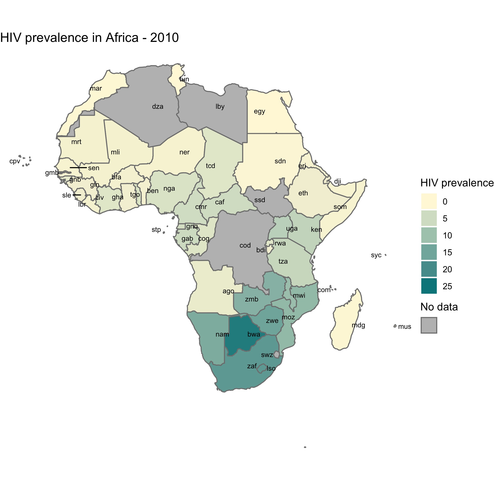]

]

.panel[.panel-name[Animated]

```{r echo=FALSE, message=FALSE, warning = FALSE, eval=FALSE}

library(transformr)
library(gifski)

hiv_latest_year <- hiv_full %>% 
  filter(continent == current_continent, year >= 1985)
#
current_continent_countries <- hiv_latest_year %>% 
  pull(country)
#
hiv_data <- map_data("world") %>% 
  filter(region %in% current_continent_countries) %>% 
  mutate(country = region) %>% 
  left_join(hiv_latest_year)
#
hiv_geos <- hiv_data %>% 
  select(geo, cen_Latitude, cen_Longitude) %>% 
  group_by(geo) %>% 
  unique()
# 

africa_anim <- ggplot(hiv_data) + 
  geom_polygon(aes(x = long, y = lat, fill = hiv_prevalence, group = group, colour = "")) + 
  coord_quickmap() +
  scale_fill_gradient2(low = "brown3", mid = "cornsilk1", high = "turquoise4", limits = c(0,25), na.value = "grey") +
  guides(fill = guide_legend(title = "HIV prevalence", order = 1)) + #change the title of the legend for hiv prevalence and make it the first legend to appear
  scale_colour_manual(values = NA) + 
  guides(colour = guide_legend("No data", override.aes = list(fill = "grey"), order = 2)) + #this is to add a legend for missing values
  theme_void()+ # this eliminates the grid in the background and axis
  geom_text_repel(data = hiv_geos, seed = 123, aes(x = cen_Longitude, y = cen_Latitude, label = geo), size = 2.5, direction = "x") +
  #labs(title = paste("HIV prevalence in Africa - ", year)) +
  transition_states(year) +
  labs(title = "HIV prevalence in Africa - {closest_state}")

animate(africa_anim, end_pause = 15, duration = 40, renderer = gifski_renderer())
anim_save("africa_hiv_anim.gif")
```


]

]

---

## Flow charts, Sankey chart 
### Research and development funding UK, 2019


```{r echo=FALSE, message=FALSE, warning = FALSE, eval=TRUE}
label=c(
                    "Business \nenterprise",
                    "Government & UKRI",
                    "Higher Education\nFunding Council",
                    "Overseas",
                    "Private non-profit",
                    "Higher education",
                    "Business \nenterprise",
                    "Higher \neducation",
                    "Government & UKRI",
                    "Private non-profit"
)


source <- c(0, 0, 0, 0, 1, 1, 1, 1, 2, 3, 3, 3, 3, 4, 4, 4, 4, 5, 5, 5)
target <- c(6, 7, 8, 9, 6, 7, 8, 9, 7, 6, 7, 8, 9, 7, 9, 6, 8, 6, 8, 9)
value <- c(20192, 362, 81, 25, 1836, 3128, 2322, 300, 2859, 3818, 1472, 157, 137, 1247, 364, 75, 81, 28, 21, 17)
source_lab <- source
target_lab <- target
```

```{r echo=FALSE, message=FALSE, warning = FALSE, eval=TRUE}

for (i in 1:length(source)){
source_lab[i] <- label[source[i]+1]
target_lab[i] <- label[target[i]+1]
}

df <- tibble(source_lab, target_lab, value)
```

```{r echo=FALSE, message=FALSE, warning = FALSE, eval=TRUE, fig.show='hide'}
library(ggalluvial)

ggplot(data = df,
       aes(axis1 = source_lab, axis2 = target_lab, y = value)) +
  geom_alluvium(aes(fill = target_lab)) +
  geom_stratum() +
  geom_text(stat = "stratum",
            aes(label = after_stat(stratum)), size = 2.7) +
  scale_x_discrete(limits = c("source", "target"),
                   expand = c(0.05, 0.05)) +
  scale_fill_viridis_d() +
  guides(fill = guide_legend(title = "Funding target")) + 
  theme_void() #+
  #theme(legend.position = "none" )# remove the legend 
ggsave("Plots/sankey.jpg")
```

.center[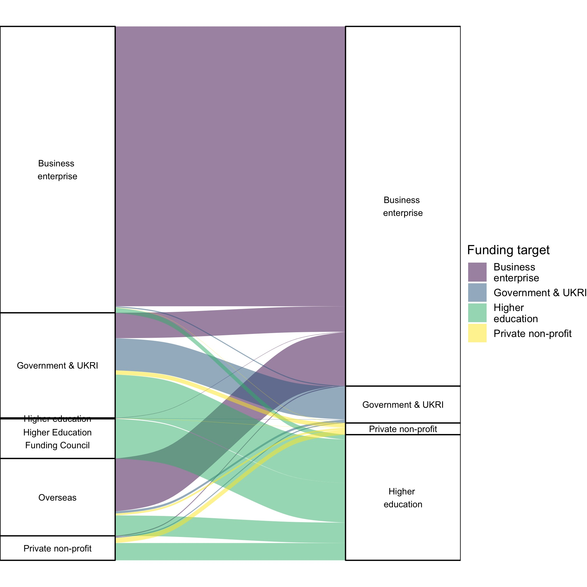]

---

## Waterfall chart

### Net profit from sales (simulated data)


```{r echo=FALSE, message=FALSE, warning = FALSE, eval=TRUE, fig.show='hide'}
month <- month.abb
value <- c(2000, 4000, 2000, -1500, -1000, -2500, 2000, 1000, 1200, 2100, -1000, 3000)
df <- data.frame(x = month, y = value) 

library(waterfalls)

waterfall(df, calc_total=TRUE, draw_lines = FALSE, rect_border = NA) + 
  theme_minimal() + 
  labs(x = "", y = "Sales ($)") +
  ggtitle("Waterfall chart of sales") 
ggsave("Plots/waterfall.jpg")
```

.center[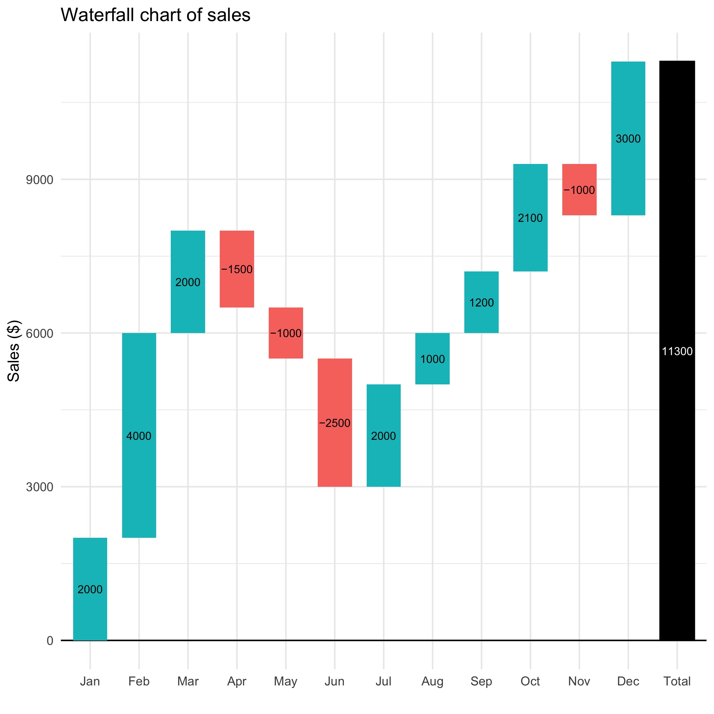]

---

### Area and stream charts 

#### COVID-19 effect on patient access to NHS diagnostics

.panelset[
.panel[.panel-name[Area Plot]

```{r echo=FALSE, message=FALSE, warning = FALSE, eval=TRUE, fig.show='hide'}
aux2 <- read_csv("Data/diagnostic_numbers_waiting.csv")

aux2 %>% 
  mutate(Diagnostic = factor(Diagnostic, ordered = TRUE, 
                             levels = c("Other", "Non-obstetric Ultrasound", "Magnetic Resonance Imaging", 
                                        "Computed Tomography", "Endoscopies"))) %>%
  mutate(number = number/1000) %>%
  ggplot(aes(x=date, y=number, fill = Diagnostic)) +
  geom_line() +
  geom_area() +
  geom_vline(xintercept = as.Date("2020-04-01"), linetype = 2, colour = "gray") +
  #annotate("text", "COVID-19 \npandemic", x = as.Date("2021-06-01"), y = 250000, label = "COVID-19 \npandemic", size = 3) +
  theme(panel.background = element_rect(fill = "transparent"),
      plot.background = element_rect(fill = "transparent", colour = NA)) +
  theme(axis.text.x = element_text(size = 8)) +
  labs(y = "Number waiting for diagnostic (thousands)", x = " ")

ggsave("Plots/diagnostic_waiters1.jpg")
```

.center[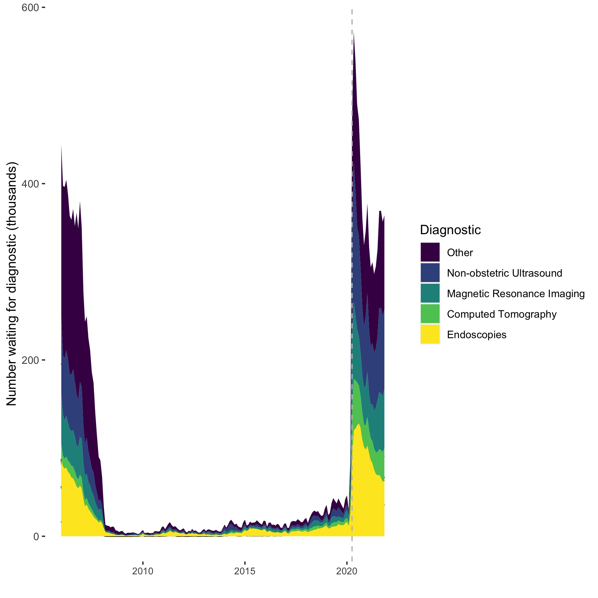]

]

.panel[.panel-name[Stream Plot]


```{r echo=FALSE, message=FALSE, warning = FALSE, eval=TRUE, fig.show='hide'}
library(ggstream)

ggplot(aux2, aes(x = date, y = number, fill = Diagnostic)) +
  geom_stream(bw = 0.1) +
  theme(panel.background = element_rect(fill = "transparent"),
      plot.background = element_rect(fill = "transparent", colour = NA)) +
  labs(y = "", x = "") +
  theme(
    axis.text.y=element_blank(),
    axis.ticks.y=element_blank()
    ) +
  scale_x_time(breaks=seq(as.Date("2006-01-01"), as.Date("2021-01-01"), "years"), labels = as.character(seq(2006, 2021, 1))) +
  geom_vline(xintercept = as.Date("2020-03-01"), linetype = "dotted") +
  annotate("text", "COVID-19 \npandemic", x = as.Date("2021-06-01"), y = 250000, label = "COVID-19 \npandemic", size = 3) +
  theme(axis.text.x = element_text(size = 6)) +
  ggtitle("Number of NHS patients waiting for a diagnostic - Jan 2006 - Nov 2021")
ggsave("Plots/diagnostic_waiters2.jpg")
```

.center[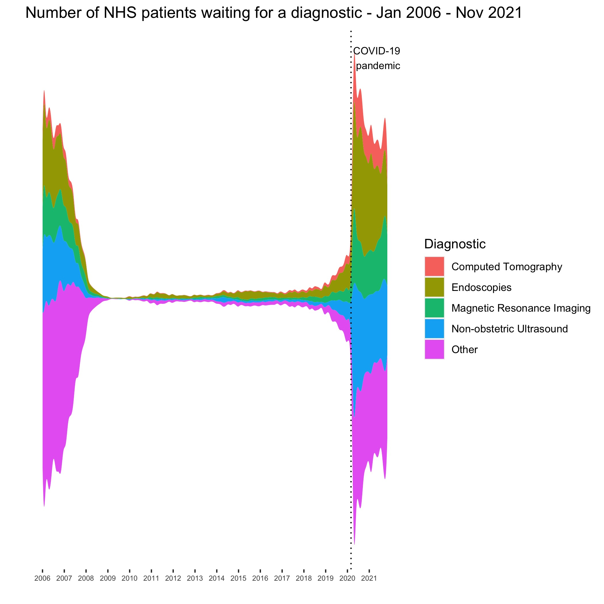]

]

]

